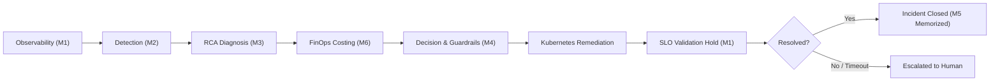
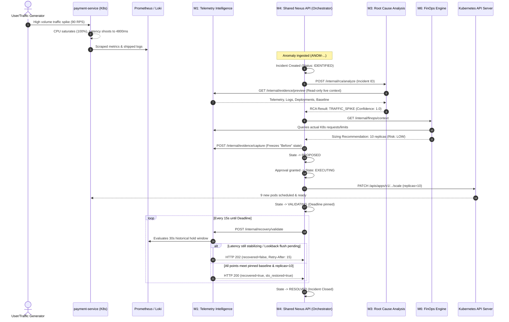

# 🚀 NEXUS AIOps & FinOps Platform: The Complete Engineering Masterclass
> **From Absolute Beginner to CTO-Grade Architectural Mastery**  
> *Project-Based Learning Guide, Deep-Dive Architecture, Problem-Solution Postmortems & File-by-File Code Walkthrough*

---

## 📑 Table of Contents
1. [Executive Summary & The "Why"](#1-executive-summary--the-why)
2. [Foundational Concepts (The Beginner Ramp-Up)](#2-foundational-concepts-the-beginner-ramp-up)
3. [System Architecture & The End-to-End Data Lifecycle](#3-system-architecture--the-end-to-end-data-lifecycle)
4. [The War Room: What Broke & How We Fixed It (Engineering Postmortems)](#4-the-war-room-what-broke--how-we-fixed-it-engineering-postmortems)
5. [File-by-File Blueprint & Technical Dissection](#5-file-by-file-blueprint--technical-dissection)
6. [CTO-Level Trade-Offs & Design Decisions](#6-cto-level-trade-offs--design-decisions)
7. [Runbook & Hands-on Verification Playbook](#7-runbook--hands-on-verification-playbook)

---

# 1. Executive Summary & The "Why"

### What is NEXUS?
In traditional tech organizations, when a production service degrades or crashes:
1. **Pagers scream:** An on-call DevOps/SRE engineer gets woken up at 3:00 AM.
2. **Scattered diagnostics:** The engineer frantically jumps across Grafana dashboards, queries Kibana/Loki logs, and checks Kubernetes pods.
3. **Trial & error:** They guess whether it’s a bad software release (memory leak / bug) or an unexpected spike in customer demand.
4. **Manual intervention:** They manually trigger a deployment rollback or bump the replica count via `kubectl scale`.
5. **Human anxiety:** They wait 20 minutes staring at latency graphs to see if the service actually healed or if they just wasted expensive cloud budget.

**NEXUS automates this entire cognitive loop (OODA Loop: Observe, Orient, Decide, Act):**
- **Observes** live health via Prometheus metrics & Loki structured logs (**M1: Telemetry Intelligence**).
- **Detects** statistical outliers and anomalies (**M2: ML Anomaly Correlation**).
- **Diagnoses** the true technical root cause deterministically (**M3: AI Root Cause Analysis**).
- **Right-sizes** solutions considering cloud cost and infrastructure risk (**M6: FinOps Optimization**).
- **Decides & Acts** through audited state-machine workflows and safe Kubernetes actuators (**M4: Decision Engine & Self-Healing**).
- **Validates SLO Restoration** by taking scientific post-remediation evidence windows before declaring an incident `RESOLVED`.
- **Learns** from the incident memory to guide future troubleshooting (**M5: Incident Memory RAG**).



---

# 2. Foundational Concepts (The Beginner Ramp-Up)

If you are new to distributed systems, DevOps, and AIOps, here is the vocabulary you need to think like a distributed systems engineer:

### 2.1 Core Metrics & SLA/SLO
- **Latency (P95 vs Average):** Average latency hides catastrophic problems! If 95 requests take 10ms and 5 requests take 5,000ms, the average is ~260ms (looks acceptable), but 5% of your paying customers experienced a broken application. **P95 (95th Percentile)** means: *"95% of requests completed faster than this number."* NEXUS uses P95 as its primary SLA metric.
- **RPS (Requests Per Second):** The throughput / offered load on an HTTP endpoint.
- **5xx Error Rate:** The ratio of server errors (`HTTP 500 Internal Server Error`, `503 Service Unavailable`, etc.) divided by total incoming traffic.
- **SLO (Service Level Objective):** The target threshold agreed upon (e.g., *“P95 latency must stay below 20ms and error rate below 1%”*).
- **Baseline:** A mathematically measured profile of a service when it is known to be 100% healthy under steady-state load. You cannot detect an abnormal state unless you have proven what a "normal" state looks like.

### 2.2 Observability Pillars
- **Prometheus (Metrics):** A time-series database that continuously polls ("scrapes") numerical gauges and counters from applications (e.g., CPU, RAM, request counts, histogram latency buckets).
- **Loki & Grafana Alloy (Logs):** 
  - Applications emit log records.
  - **Grafana Alloy** acts as a high-performance daemon reading container log files directly from the Kubernetes host disk and shipping them to **Grafana Loki**.
  - **Loki** indexes labels (namespace, pod, service) rather than full text, making log storage lightweight and fast.

### 2.3 Kubernetes Primitives
- **Pod:** The smallest deployable computing unit in Kubernetes containing one or more containers.
- **Deployment & ReplicaSet:** A Deployment declares how many identical copies (replicas) of a Pod should run. If traffic increases, changing replicas from 1 to 10 tells Kubernetes to spin up 9 more Pods.
- **RBAC (Role-Based Access Control):** Security rules specifying which service account can perform specific actions (e.g., M4 is allowed to patch `deployments/scale`, but M1 is strictly read-only).

---

# 3. System Architecture & The End-to-End Data Lifecycle

Here is the exact step-by-step journey of an incident inside the NEXUS ecosystem:



---

# 4. The War Room: What Broke & How We Fixed It (Engineering Postmortems)

Building a robust multi-service autonomous system always uncovers deep edge cases. Here are the pivotal bugs solved during the integration, their root causes, and how we engineered the fixes.

---

### Incident 1: The Circular Dependency Deadlock (M1 ↔ M3 ↔ M4)
* **The Symptom:** M4 could not diagnose an incident without calling M3 RCA. M3 RCA refused to diagnose without M1 evidence. But M1 would only capture evidence if M4 provided a known scenario (`traffic_spike` vs `bad_deployment`).
* **Root Cause:** A classical chicken-and-egg architecture flaw. You cannot know the scenario until you diagnose it, but you could not capture evidence without knowing the scenario.
* **The Fix (`Evidence Preview Pattern`):**
  - We decoupled evidence inspection into two distinct lifecycle phases:
    1. **Evidence Preview (`GET /internal/evidence/preview`):** Strictly read-only, ephemeral snapshot of current metrics, logs, deployments, and Kubernetes pod states. No incident ID or scenario required. M3 consumes this to form its diagnosis.
    2. **Evidence Capture (`POST /internal/evidence/capture`):** Immutable, scenario-bound evidence snapshot frozen to persistent storage (PVC) once M4 has classified the event and prepares an actionable proposal.

---

### Incident 2: High Concurrency Log-Sink Thread Starvation in `payment-service`
* **The Symptom:** Under simulated traffic spikes (>80 RPS), the payment service worker began dropping connection sockets and latency spiked exponentially.
* **Root Cause:** In Python's standard `logging` module, writing to `stdout` (`StreamHandler`) is synchronous and acquires an internal I/O lock. When 100 concurrent requests all try to log JSON lines simultaneously, threads block waiting on terminal stream I/O instead of processing HTTP transactions.
* **The Fix (`Bounded Queue & Background Draining Listener`):**
  - We modified [`apps/demo-microservices/payment-service/app.py`](file:///e:/AIOPS/final%20project/apps/demo-microservices/payment-service/app.py):
    1. Introduced a `NonblockingLogHandler(QueueHandler)` backed by an in-memory `queue.Queue(maxsize=1024)`.
    2. Enqueuing is non-blocking (`put_nowait`). If the queue fills under extreme load, incoming records are discarded, and a custom Prometheus counter `nexus_log_records_dropped_total` is incremented.
    3. Dedicated `DrainingLogListener` thread handles stream formatting and stdout I/O completely out-of-band.
    4. Clean shutdown hook drains the queue within a strict 5-second deadline.

---

### Incident 3: Connection Exhaustion in Prometheus Client Queries
* **The Symptom:** During recovery polling, M1's requests to Prometheus started intermittently failing with `HTTP 503 Provider Unavailable` or timeouts.
* **Root Cause:** M1 was spawning a brand-new `httpx.AsyncClient()` on every single PromQL query. In a recovery cycle where M1 checks 6 metrics across multiple lookback windows every 15 seconds, this caused rapid TCP socket churn and ephemeral port exhaustion.
* **The Fix (`Shared Async Connection Pooling`):**
  - Refactored [`services/telemetry-intelligence/app/providers/prometheus.py`](file:///e:/AIOPS/final%20project/services/telemetry-intelligence/app/providers/prometheus.py):
    ```python
    self._http_client = httpx.AsyncClient(
        timeout=self.timeout,
        limits=httpx.Limits(max_connections=100, max_keepalive_connections=20, keepalive_expiry=30)
    )
    ```
  - Reused persistent HTTP/1.1 keep-alive TCP connections across all polling cycles.

---

### Incident 4: The Latency Ceiling Mismatch (`PAYMENT_WORK_ITERATIONS`)
* **The Symptom:** In the automated run `INC-K8S-SCALE-AUTO-20261009`, M4 scaled the payment service to 10 replicas. Traffic was smoothly handled at 88 RPS. Latency dropped from 4888ms down to 18.9ms (a 99.6% reduction!). Yet M1 persistently returned `recovered=false, slo_restored=false`, causing M4 to timeout and escalate!
* **Root Cause:**
  - When the initial baseline was measured, `PAYMENT_WORK_ITERATIONS` was set to `0` (instant dummy endpoint). The measured healthy P95 was **12.06 ms**.
  - The strict SLO formula is:
    $$\text{Latency Threshold} = \text{Baseline P95} \times 1.25 = 12.06 \times 1.25 = 15.07\text{ ms}$$
  - Later, we configured realistic CPU work: `PAYMENT_WORK_ITERATIONS=20000` (calculating sha256 hashes to simulate actual business logic). Under 20,000 iterations, the real healthy P95 is naturally **~19 ms**.
  - Even though the service recovered completely, **18.9ms > 15.07ms**. M1 mathematically rejected the recovery because it compared against a stale baseline collected under different computational assumptions!
* **The Lesson & Fix:**
  - **A baseline is only valid for the exact runtime configuration under which it was measured.** If you change container CPU limits, memory limits, or application workload parameters, you must re-measure the healthy baseline.

---

### Incident 5: State Machine Illegal Transition (`EXECUTING -> EXECUTING`)
* **The Symptom:** Approving an incident via `/api/incidents/{id}/approve` succeeded (HTTP 200), but executing the remediation returned an immediate `HTTP 400 Bad Request`.
* **Root Cause:** The approval endpoint transitioned the incident state to `EXECUTING`. Then, when `/internal/remediation/execute` was invoked, it tried to transition `status` from `EXECUTING` to `EXECUTING`, which was explicitly forbidden by the strict finite-state machine transitions table.
* **The Fix:**
  - Unified the execution pipeline: `approve_incident()` now atomically initiates execution inside the same locked critical section, returning a single canonical `ActionResult`.

---

# 5. File-by-File Blueprint & Technical Dissection

Here is the architectural catalog of every vital file across the repository:

### 5.1 The Workload: `apps/demo-microservices/payment-service/`
* [`app.py`](file:///e:/AIOPS/final%20project/apps/demo-microservices/payment-service/app.py): The FastAPI application handling `/pay`. Exposes Prometheus metrics (`nexus_http_requests_total`, `nexus_http_request_duration_seconds`, `nexus_log_records_dropped_total`). Implements controllable fault injection (`FAULT_LATENCY_MS`, `FAULT_5XX_RATE`, `PAYMENT_WORK_ITERATIONS`) and nonblocking queue logging.
* [`Dockerfile`](file:///e:/AIOPS/final%20project/apps/demo-microservices/payment-service/Dockerfile): Container image definition. Disables Uvicorn default synchronous access logs to avoid stdout contention.

### 5.2 M1: `services/telemetry-intelligence/`
* [`app/main.py`](file:///e:/AIOPS/final%20project/services/telemetry-intelligence/app/main.py): Entrypoint defining M1 API routes (`/health`, `/internal/telemetry/snapshot`, `/internal/evidence/preview`, `/internal/baselines/measure`, `/internal/recovery/validate`).
* [`app/service.py`](file:///e:/AIOPS/final%20project/services/telemetry-intelligence/app/service.py): Core telemetry engine. Orchestrates Prometheus metric fetching, Loki log selection, and Kubernetes deployment metadata. Enforces quality gates for baseline collection (minimum sample count, coverage ratio, 5xx bounds).
* [`app/providers/prometheus.py`](file:///e:/AIOPS/final%20project/services/telemetry-intelligence/app/providers/prometheus.py): PromQL query execution with client connection pooling and millisecond-level timestamp normalization.
* [`app/providers/kubernetes.py`](file:///e:/AIOPS/final%20project/services/telemetry-intelligence/app/providers/kubernetes.py): Read-only Kubernetes client extracting Pod status, ReplicaSet generation, container versions, and cluster events.

### 5.3 M3: `services/root-cause-analysis/`
* [`app/main.py`](file:///e:/AIOPS/final%20project/services/root-cause-analysis/app/main.py): Exposes `POST /internal/rca/analyze`.
* [`app/service.py`](file:///e:/AIOPS/final%20project/services/root-cause-analysis/app/service.py): RCA business logic. Queries M1 preview endpoints for live evidence and routes to the scoring engine.
* [`app/scoring.py`](file:///e:/AIOPS/final%20project/services/root-cause-analysis/app/scoring.py): Deterministic heuristic classification. Compares current metrics against the baseline. If error rates correlate with a new deployment SHA, classifies as `BAD_DEPLOYMENT`. If latency and CPU surge with elevated RPS while version is unchanged, classifies as `TRAFFIC_SPIKE`.

### 5.4 M6: `services/finops-engine/`
* [`app/main.py`](file:///e:/AIOPS/final%20project/services/finops-engine/app/main.py): Exposes `/internal/finops/context` and `/internal/finops/scale-options`.
* [`app/m1_client.py`](file:///e:/AIOPS/final%20project/services/finops-engine/app/m1_client.py): Translates M1 unit representations (ratios against limits) into FinOps container sizing equations (percentages against requests).
* [`app/scale_options.py`](file:///e:/AIOPS/final%20project/services/finops-engine/app/scale_options.py): Computes replica scaling choices with risk scoring (`LOW`, `MEDIUM`, `HIGH`) and cost projections.

### 5.5 M4: `services/shared-nexus-api/`
* [`app/orchestration/orchestrator.py`](file:///e:/AIOPS/final%20project/services/shared-nexus-api/app/orchestration/orchestrator.py): The brain of NEXUS. Coordinates RCA, FinOps, evidence freezing, approval execution, and the bounded stabilization polling loop.
* [`app/decision_engine/engine.py`](file:///e:/AIOPS/final%20project/services/shared-nexus-api/app/decision_engine/engine.py): Formulates formal `DecisionProposal` contracts based on RCA diagnosis and FinOps safety constraints.
* [`app/remediation/executor.py`](file:///e:/AIOPS/final%20project/services/shared-nexus-api/app/remediation/executor.py): Interacts directly with Kubernetes. Patches Deployment replica counts, triggers image rollbacks, and watches deployment rollout status until complete.
* [`app/remediation/guardrails.py`](file:///e:/AIOPS/final%20project/services/shared-nexus-api/app/remediation/guardrails.py): Safety checks preventing dangerous actions (e.g., maximum replica cap = 10, cannot scale down during an incident, cannot roll back to unknown images).
* [`app/state_machine/machine.py`](file:///e:/AIOPS/final%20project/services/shared-nexus-api/app/state_machine/machine.py): Strict finite-state transitions: `IDENTIFIED` $\rightarrow$ `CORRELATING` $\rightarrow$ `DIAGNOSED` $\rightarrow$ `PROPOSED` $\rightarrow$ `APPROVED` $\rightarrow$ `EXECUTING` $\rightarrow$ `VALIDATING` $\rightarrow$ `RESOLVED` / `ESCALATED`.

### 5.6 Automated Harness: `scripts/`
* [`run-integration-incident.ps1`](file:///e:/AIOPS/final%20project/scripts/run-integration-incident.ps1): The master E2E integration runner. Takes an observed anomaly JSON file, creates the incident in M4, triggers RCA, builds the decision, approves execution, and polls M1 recovery until resolution.
* [`k8s-traffic.py`](file:///e:/AIOPS/final%20project/scripts/k8s-traffic.py): In-cluster synthetic load generator with fixed RPS rates, concurrency caps, interval statistics, and dropped-slot accounting.

---

# 6. CTO-Level Trade-Offs & Design Decisions

When presenting this project to Senior Staff Engineers, Architects, or CTOs, these are the core architectural debates and trade-offs you must explain:

| Decision | What We Chose | Why We Chose It | Alternative Rejected & Trade-Off |
| :--- | :--- | :--- | :--- |
| **Recovery Window Holding** | Strict 30s multi-point hold window | Eliminates transient "fake" recoveries where a single fast ping passes while pods are still thrashing. | **Single-point check:** Fast, but high risk of declaring success prematurely. |
| **RBAC Isolation** | ServiceAccount with scoped permissions | Security principle of least privilege. M1 can only read; only M4 can patch payment scale. | **Root cluster-admin:** Simple to set up, but catastrophic security risk in enterprise multi-tenant clusters. |
| **Logging Architecture** | Non-blocking Queue + Drop Counter | Protects service availability. A service must never crash or stall customer payments simply because logging is slow. | **Blocking stdout:** Preserves 100% of logs, but degrades transaction latency under load. |
| **Deterministic RCA vs LLM Prompts** | Heuristic mathematical scoring | Instant (<50ms), 100% reproducible, zero hallucinations, operates offline without API costs. | **Direct LLM prompting:** Handles unforeseen edge cases, but non-deterministic, slow (2-5s), and expensive. |
| **Stabilization Timeout Policy** | Pinned to action completion timestamp | Prevents infinite polling loops. Polling client retries cannot artificially extend the SLA deadline. | **Floating timeout:** Resets on every poll, causing runaway validation cycles. |

---

# 7. Runbook & Hands-on Verification Playbook

Whenever you need to demonstrate the entire platform live, follow this exact sequence:

### Step 1: Ensure Cluster & Services are Up
```powershell
& .\.review-branches\tools\kubectl.exe --kubeconfig .\.review-branches\kubeconfig get pods -n nexus-demo
```
*Expected: `telemetry-intelligence`, `shared-nexus-api`, `root-cause-analysis`, `finops-engine`, `payment-service`, `prometheus`, and `loki` are all in `Running` state.*

### Step 2: Establish Healthy Baseline
1. Send clean traffic (30 RPS, 0 errors) for 2–3 minutes.
2. Trigger baseline calculation:
```powershell
$baselineEnd = [DateTimeOffset]::UtcNow.AddSeconds(-15)
$body = @{
    service = "payment-service"
    start   = $baselineEnd.AddSeconds(-75).ToString("o")
    end     = $baselineEnd.ToString("o")
} | ConvertTo-Json

Invoke-RestMethod -Method Post -Uri "http://127.0.0.1:18001/internal/baselines/measure" -Body $body -ContentType "application/json"
```

### Step 3: Trigger the Traffic Spike Scenario
Launch the spike traffic generator (90 RPS targeting payment-service). Observe the P95 latency rising to >4000ms in Prometheus or Grafana.

### Step 4: Run the Autonomous Self-Healing Incident
```powershell
.\scripts\run-integration-incident.ps1 -AnomalyPath .review-branches/observed-anomaly.json -Approve
```

### What You Will Observe in Real-Time:
1. `M4` ingests anomaly & creates incident.
2. `M3` inspects `M1` evidence preview and diagnoses `TRAFFIC_SPIKE`.
3. `M6` sizes payment service to 10 replicas with `LOW` risk.
4. `M4` executes scale action via Kubernetes API.
5. Kubernetes launches 9 new payment pods.
6. `M4` polls `M1` recovery: M1 returns HTTP 202 while metric lookback flushes.
7. Once the 30-second hold completes with all points meeting baseline thresholds, M1 confirms:
   ```json
   { "recovered": true, "slo_restored": true }
   ```
8. `M4` marks incident `RESOLVED`.
