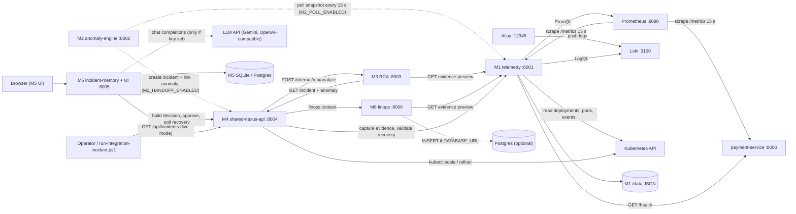
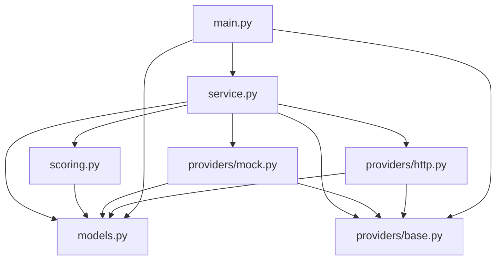
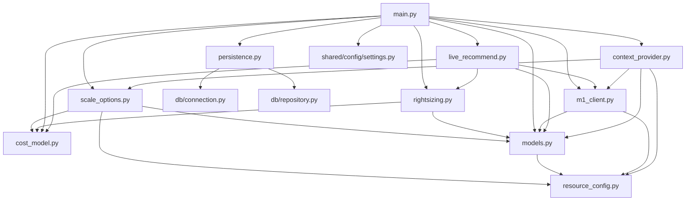

# 00 · Inventory: what is actually in the NEXUS repo

> **Phase 0 (Reconnaissance), redone on 2026-10-10.** Documented commit `3cd0423` (2026-10-10 12:34 +03:00, "Merge branch 'origin/codex/m5-memory-copilot' into mugalal/integrate-m2"). This replaces the first inventory, which was pinned to `5a6858b`. Every NEXUS-specific statement cites a file and line from `3cd0423`. Nothing was run against a cluster; outputs are `(expected, not executed)` unless labelled `(observed)`.

## 0. How this inventory was built (read this first)

- **Source of truth.** Your local folder `E:\AIOPS\final project` is on branch `mugalal/integrate-m2` at `3cd04239175a204fc84df2aeabd79a67f8c09857` `(observed: git rev-parse HEAD)`. This commit merges M2 (`a0f77e7`, which is on GitHub) and M5 (`d16e58c`, on GitHub). **The merge commit itself is not pushed yet**: GitHub's `mugalal/integrate-m2` still points at `a0f77e7`.
- **How I read it.** I rebuilt the same merge from the GitHub commits in my own workspace. The only conflict was `README.md`, so I copied your resolved README over. The rebuilt tree hash is `64ae68e`, **identical** to `3cd0423^{tree}` on your laptop `(observed)`, so every file I scanned is byte-for-byte your commit.
- **Uncommitted work.** `git status` on your laptop `(observed)` shows 5 modified tracked files and 1 new untracked manifest. They are **not** part of the documented commit; §4.1 summarises them, because one of them changes M4.
- **Read-only.** No source file was edited, and no git command that changes anything was run. Read-only commands on your laptop: `git status`, `git log`, `git diff`, `git rev-parse`, `git ls-tree`, `git archive` (into a scratch folder outside your project). No kubectl or curl.
- **Counting method.** Functions, classes, tests, endpoints, env-var reads and regex calls were counted by parsing every `.py` file with Python's `ast` module. Queries, Kubernetes resources and config keys were counted by parsing YAML and searching for query markers. §9 has the full lists.
- **Franco notes** appear like this: *(ya3ni: …)*.

## 1. NEXUS at a glance

| Fact | Value | Evidence |
|---|---|---|
| Tracked files at commit | 405 (303 code/config/docs/data + 102 evidence data files); was 312 at `5a6858b` | `git ls-tree -r 3cd0423` |
| Lines in the 303 non-evidence files | 32,583 | `wc -l` |
| Services that exist as code | **M1** telemetry-intelligence (8001), **M2** anomaly-engine (8002), **M3** root-cause-analysis (8003), **M4** shared-nexus-api (8004), **M5** incident-memory (8005, also serves the UI), **M6** finops-engine (8006), demo **payment-service** (8000) | `services/*/app/main.py`, Dockerfiles |
| All six modules present? | **Yes, for the first time.** But M2 has no Dockerfile/compose/k8s entry, and M5 is not wired into M4 in the commit (only in uncommitted edits) | §4.1, §10 |
| Language / framework | Python 3.11 (M1, M3, M4, demo), 3.12 (M6), 3.13 (M5) + FastAPI; plain JavaScript UI | Dockerfiles line 1; `ui/` |
| Where it runs | Docker Compose (`observability/docker-compose.yml`) and a 3-node kind cluster `nexus`, namespace `nexus-demo`. M2 runs only as a local `uvicorn` process | `docs/REAL_SERVICE_INTEGRATION.md:L103-L108` |
| ML | **Yes (M2):** per-service z-score detector with a frozen reference at runtime; Isolation Forest is used offline for comparison | `services/anomaly-engine/app/model.py`, `reference/reference.json` |
| LLM | **Yes (M5, optional):** OpenAI-compatible chat API, Gemini endpoint by default, off unless a key is set | `services/incident-memory/app/chat.py:L73-L82` |
| "RAG" retrieval | **Keyword/tag overlap scoring, no embeddings or vector store** | `services/incident-memory/app/retrieval.py:L5-L35` |
| Data stores | M4: Python memory. M1: JSON files. M2: memory + optional JSONL evidence. M5: SQLite (default) or Postgres, own table `m5_incident_memory`. Shared Postgres schema: only M6 writes | §9.9 |
| CI | **One workflow, M5 only** (`.github/workflows/m5.yml`), triggered by changes to M5, `ui/`, `contracts/`, `mocks/`, `shared/` | `.github/workflows/m5.yml:L2-L6` |

*(ya3ni: el modules el sitta mawgoudeen dilwa2ty fel commit, bas M2 lessa mesh container, w M5 lessa mesh marboot b M4 fel commit.)*

## 2. Directory map (every directory and why it exists)

| Directory | Why it exists | Files |
|---|---|---|
| `(repo root)` | Project README, .gitignore, .dockerignore | 3 |
| `.github` | GitHub pull-request template | 1 |
| `.github/workflows` | GitHub Actions CI (M5 only) | 1 |
| `apps/demo-microservices` | Ownership note for the demo workload | 1 |
| `apps/demo-microservices/k8s` | Kubernetes manifests for healthy v1 and faulty v2 payment-service | 2 |
| `apps/demo-microservices/payment-service` | Source and image of the service NEXUS monitors | 3 |
| `contracts` | Frozen JSON shapes every module agreed on Day 1 | 12 |
| `docs` | Team process docs, reviews, drills and integration notes | 16 |
| `infrastructure` | kind cluster definition and setup notes | 2 |
| `infrastructure/k8s` | In-cluster traffic generator Pod | 1 |
| `infrastructure/postgres` | Local Postgres container for the shared DB | 1 |
| `mocks` | Mock payloads matching the contracts, used by mock modes and tests | 11 |
| `observability` | Docker Compose stack for the whole platform | 2 |
| `observability/alloy` | Log shipper config for Compose | 1 |
| `observability/grafana/dashboards` | The M1 Grafana dashboard | 1 |
| `observability/grafana/provisioning/dashboards` | Grafana auto-load config for dashboards | 1 |
| `observability/grafana/provisioning/datasources` | Grafana data source config | 1 |
| `observability/k8s` | Prometheus, Loki and Alloy for Kubernetes | 4 |
| `observability/prometheus` | Prometheus scrape config for Compose | 1 |
| `scripts` | Traffic generators, smoke checks, env checks, DB helpers, the incident driver | 11 |
| `services/anomaly-engine` | M2 service root (README, requirements, captures, results) | 6 |
| `services/anomaly-engine/app` | M2 source: features, scoring, correlation, handoff, poller | 11 |
| `services/anomaly-engine/app/evaluation` | M2 offline evaluation on synthetic scenarios | 6 |
| `services/anomaly-engine/app/realdata` | M2 tools for real captures, training and drills | 9 |
| `services/anomaly-engine/data` | M2 runtime data (gitignored contents) | 1 |
| `services/anomaly-engine/reference` | M2 frozen model (reference.json) | 1 |
| `services/finops-engine` | M6 service root (Dockerfile, README, requirements) | 3 |
| `services/finops-engine/app` | M6 source code | 11 |
| `services/finops-engine/k8s` | M6 Kubernetes manifest | 1 |
| `services/finops-engine/tests` | M6 pytest tests | 9 |
| `services/incident-memory` | M5 service root (Dockerfile, compose, env template) | 5 |
| `services/incident-memory/app` | M5 source: storage, retrieval, copilot, LLM chat, tools | 11 |
| `services/incident-memory/scripts` | M5 evaluation, seeding and Docker check scripts | 3 |
| `services/incident-memory/tests` | M5 unittest suite | 4 |
| `services/root-cause-analysis` | M3 service root | 3 |
| `services/root-cause-analysis/app` | M3 source code | 6 |
| `services/root-cause-analysis/app/providers` | M3 evidence providers (HTTP and mock) | 4 |
| `services/root-cause-analysis/k8s` | M3 Kubernetes manifest | 1 |
| `services/root-cause-analysis/tests` | M3 pytest tests | 3 |
| `services/shared-nexus-api` | M4 service root (also hosts the shared DB package) | 5 |
| `services/shared-nexus-api/app` | M4 entrypoint, config, contracts | 4 |
| `services/shared-nexus-api/app/api` | M4 HTTP routers | 6 |
| `services/shared-nexus-api/app/db` | Shared Postgres schema and helpers (used by M6, not by M4) | 7 |
| `services/shared-nexus-api/app/decision_engine` | M4 decision rules | 2 |
| `services/shared-nexus-api/app/orchestration` | M4 incident workflow | 2 |
| `services/shared-nexus-api/app/providers` | M4 HTTP clients for M1, M3, M6 | 5 |
| `services/shared-nexus-api/app/remediation` | M4 actuators, guardrails, audit | 6 |
| `services/shared-nexus-api/app/state_machine` | M4 incident state machine | 4 |
| `services/shared-nexus-api/k8s` | M4 Kubernetes manifest with RBAC | 1 |
| `services/shared-nexus-api/shared_nexus_providers` | Packaged provider interfaces (unused) | 1 |
| `services/shared-nexus-api/shared_nexus_providers/providers` | Provider base/error classes (unused) | 3 |
| `services/shared-nexus-api/tests` | M4 pytest tests | 17 |
| `services/telemetry-intelligence` | M1 service root | 2 |
| `services/telemetry-intelligence/app` | M1 source code | 9 |
| `services/telemetry-intelligence/app/providers` | M1 clients for Prometheus, Loki, Kubernetes, payment health | 7 |
| `services/telemetry-intelligence/k8s` | M1 Kubernetes manifest with RBAC | 1 |
| `shared/config` | Runtime settings shared by M1 and M6 | 2 |
| `shared/contracts` | Pydantic models of the 11 frozen contracts (used by M2) | 2 |
| `shared/logging` | JSON logging shared by M1 and M6 | 2 |
| `tests` | Repo-level tests package | 2 |
| `tests/contract` | Contract-vs-model tests | 1 |
| `tests/integration` | Four-process HTTP integration test | 4 |
| `tests/m1` | M1 unittest suite | 11 |
| `tests/m2` | M2 pytest suite and fakes | 14 |
| `ui` | M5 web UI shell and entry script | 3 |
| `ui/components` | UI rendering helpers | 1 |
| `ui/copilot` | UI copilot chat view and history storage | 3 |
| `ui/incident` | UI incident detail view | 1 |
| `ui/overview` | UI incident overview | 1 |
| `docs/evidence/…` (7 folders) | Saved outputs of real runs on 2026-10-09 (JSON/JSONL/TXT/MD) | 102 |

## 3. File inventory

Tiers are my **proposal** (Tier 1 = walk the whole file; Tier 2 = every function, tricky parts line by line; Tier 3 = short entry, every field listed; ⏭️ = data, described not walked through). Galal can change any of them.

### 3.1 M1 Telemetry Intelligence (38 files, 5159 lines)

| Path | Type | Tier | One-line purpose | Lines |
|---|---|---|---|---|
| `observability/alloy/config.alloy` | Alloy config | 2 | Docker Compose log shipper: discovers containers via docker.sock and pushes logs to Loki. | 44 |
| `observability/grafana/dashboards/nexus-m1-overview.json` | Grafana dashboard | 1 | Six-panel dashboard (request rate, P95, 5xx, CPU, memory, replicas) with its own PromQL. | 71 |
| `observability/grafana/provisioning/dashboards/dashboards.yml` | Grafana provisioning | 3 | Tells Grafana to load dashboards from /var/lib/grafana/dashboards into folder NEXUS. | 12 |
| `observability/grafana/provisioning/datasources/datasources.yml` | Grafana provisioning | 3 | Registers the Prometheus (default) and Loki data sources. | 15 |
| `observability/k8s/alloy.yaml` | K8s manifest (RBAC) | 1 | Alloy DaemonSet + ServiceAccount/Role/RoleBinding + ConfigMap: tails pod log files and ships them to Loki. | 193 |
| `observability/k8s/loki.yaml` | K8s manifest | 2 | Loki ConfigMap, 5Gi PVC, single-replica Deployment and Service. | 141 |
| `observability/k8s/prometheus.yaml` | K8s manifest (RBAC) | 1 | Prometheus RBAC, scrape ConfigMap (pod discovery by annotation), Deployment, 5Gi PVC, Service. | 169 |
| `observability/prometheus/prometheus.yml` | Prometheus config | 1 | Docker Compose scrape config: static targets payment-service:8000 and telemetry-intelligence:8001 every 15 s. | 33 |
| `services/telemetry-intelligence/Dockerfile` | Dockerfile | 2 | Builds the M1 image (python:3.11-slim, port 8001, PYTHONPATH=/app). | 19 |
| `services/telemetry-intelligence/app/__init__.py` | Python (package marker) | 3 | Package docstring only. | 1 |
| `services/telemetry-intelligence/app/baseline.py` | Python | 1 | Computes a healthy baseline (percentiles) and SLO thresholds from a telemetry window. | 109 |
| `services/telemetry-intelligence/app/config.py` | Python (config) | 1 | M1Settings: 31 settings loaded from env vars, plus duration parsing ('1m' to seconds). | 152 |
| `services/telemetry-intelligence/app/errors.py` | Python | 3 | M1 error classes with HTTP status, category and retryable flag. | 64 |
| `services/telemetry-intelligence/app/main.py` | Python (FastAPI entrypoint) | 1 | M1 FastAPI app: 15 routes, own Prometheus metrics, request middleware, provider wiring. | 324 |
| `services/telemetry-intelligence/app/models.py` | Python (Pydantic models) | 2 | Strict Pydantic models for snapshots, windows, baselines, evidence, recovery. | 205 |
| `services/telemetry-intelligence/app/providers/__init__.py` | Python (package) | 3 | Re-exports provider classes. | 13 |
| `services/telemetry-intelligence/app/providers/health.py` | Python | 2 | Probes the payment-service /health endpoint. | 39 |
| `services/telemetry-intelligence/app/providers/kubernetes.py` | Python | 2 | Kubernetes context through the kubectl CLI (fallback when no in-cluster token). | 268 |
| `services/telemetry-intelligence/app/providers/kubernetes_api.py` | Python | 1 | Kubernetes context through the in-cluster REST API with the service-account token. | 154 |
| `services/telemetry-intelligence/app/providers/loki.py` | Python | 1 | Loki client: one LogQL stream selector over /loki/api/v1/query_range. | 93 |
| `services/telemetry-intelligence/app/providers/prometheus.py` | Python | 1 | Pooled async Prometheus HTTP client for instant and range queries. | 179 |
| `services/telemetry-intelligence/app/providers/resources.py` | Python | 2 | Parses Kubernetes resource quantities (m, Mi, Gi) to millicores and MiB. | 59 |
| `services/telemetry-intelligence/app/service.py` | Python | 1 | M1Service: health, snapshot, window, baseline, evidence capture/preview, recovery validation. | 380 |
| `services/telemetry-intelligence/app/storage.py` | Python | 2 | EvidenceStore: JSON files on disk for baselines, incidents and recoveries, with safe names. | 128 |
| `services/telemetry-intelligence/app/telemetry.py` | Python | 1 | Builds all M1 PromQL queries and turns results into snapshots and windows, with freshness checks. | 247 |
| `services/telemetry-intelligence/k8s/telemetry-intelligence.yaml` | K8s manifest (RBAC) | 1 | M1 ServiceAccount, read-only Role, Deployment (Recreate), 1Gi PVC, Service on 8001. | 155 |
| `services/telemetry-intelligence/requirements.txt` | Dependencies | 3 | Pinned M1 packages (fastapi, httpx, prometheus-client, pydantic, uvicorn[standard]). | 5 |
| `tests/m1/__init__.py` | Python (package) | 3 | Package docstring only. | 7 |
| `tests/m1/support.py` | Python (test helpers) | 2 | Fake providers and factories shared by M1 tests. | 214 |
| `tests/m1/test_api.py` | unittest tests | 2 | M1 API endpoint tests. | 103 |
| `tests/m1/test_baseline_and_recovery.py` | unittest tests | 2 | Baseline quality gates and recovery validation tests. | 344 |
| `tests/m1/test_contracts.py` | unittest tests | 3 | M1 outputs match frozen contracts. | 76 |
| `tests/m1/test_evidence_preview.py` | unittest tests | 2 | Evidence preview and resource configuration tests. | 123 |
| `tests/m1/test_kubernetes_provider.py` | unittest tests | 2 | kubectl and in-cluster Kubernetes provider tests with fixtures. | 268 |
| `tests/m1/test_payment_probe_concurrency.py` | unittest tests | 2 | Payment-service probes and the non-blocking log handler under concurrency. | 228 |
| `tests/m1/test_prometheus_client_pool.py` | unittest tests | 2 | Prometheus client connection-pool reuse and close tests. | 123 |
| `tests/m1/test_prometheus_telemetry.py` | unittest tests | 2 | PromQL query building, freshness and response parsing tests. | 248 |
| `tests/m1/test_storage.py` | unittest tests | 2 | EvidenceStore read/write and safe-name tests. | 153 |

### 3.2 M2 Anomaly Detection & Correlation (48 files, 13015 lines)

| Path | Type | Tier | One-line purpose | Lines |
|---|---|---|---|---|
| `services/anomaly-engine/README.md` | Markdown (docs) | 3 | M2 README: design, detectors compared, evaluation tables, drills, live results, how to run. | 581 |
| `services/anomaly-engine/app/__init__.py` | Python (package) | 3 | Package docstring and version. | 15 |
| `services/anomaly-engine/app/baseline.py` | Python | 2 | Threshold alarm (not ML): 6 weighted fixed rules (latency_p95 and 5xx weight 1.5; cpu, memory, request-rate change, latency change 1.0); used when no frozen reference covers a service. | 165 |
| `services/anomaly-engine/app/correlation.py` | Python | 1 | Groups alerts closer than 120 s into one incident candidate per service, and tracks its handoff state. | 175 |
| `services/anomaly-engine/app/evaluation/__init__.py` | Python (package marker) | 3 | Empty package marker. | 0 |
| `services/anomaly-engine/app/evaluation/compare.py` | Python (CLI) | 2 | Offline comparison: Isolation Forest vs the threshold baseline on synthetic runs. | 193 |
| `services/anomaly-engine/app/evaluation/metrics.py` | Python | 2 | Precision, recall, F1, false alarms and detection delay for a detector over runs. | 203 |
| `services/anomaly-engine/app/evaluation/run.py` | Python (CLI) | 3 | Command-line runner that prints the Day-2 evaluation tables. | 138 |
| `services/anomaly-engine/app/evaluation/scenarios.py` | Python | 2 | Seeded synthetic telemetry for healthy, bad_deployment and traffic_spike runs. | 194 |
| `services/anomaly-engine/app/evaluation/tune.py` | Python | 2 | Grid search of baseline thresholds for best F1 under a false-alarm cap. | 100 |
| `services/anomaly-engine/app/evidence.py` | Python | 3 | Appends alert evidence (score + features) to a JSONL file. | 46 |
| `services/anomaly-engine/app/features.py` | Python | 1 | Builds the 8-feature vector from a snapshot (adds request-rate and latency change vs the previous reading). | 86 |
| `services/anomaly-engine/app/handoff.py` | Python | 1 | Client that creates the incident in M4 (POST /api/incidents/) and links the AnomalyEvent (POST /internal/anomalies). | 117 |
| `services/anomaly-engine/app/main.py` | Python (FastAPI entrypoint) | 1 | M2 FastAPI app on 8002: 6 routes, env-driven setup, optional background poller started in lifespan. | 247 |
| `services/anomaly-engine/app/model.py` | Python (ML) | 1 | IsolationForestDetector (sklearn) and ZScoreDetector (per-service mean/spread 'wobbles'); the runtime uses the z-score one. | 290 |
| `services/anomaly-engine/app/pipeline.py` | Python | 1 | Scores each reading (frozen reference or threshold), decides alert/severity, correlates, saves evidence, hands off. | 366 |
| `services/anomaly-engine/app/poller.py` | Python | 1 | Background loop: every 15 s fetches each watched service's snapshot from M1 and feeds the pipeline. | 122 |
| `services/anomaly-engine/app/realdata/__init__.py` | Python (package marker) | 3 | Empty package marker. | 0 |
| `services/anomaly-engine/app/realdata/__main__.py` | Python (CLI) | 2 | `python -m app.realdata` subcommands: drill, fetch, report, train, evaluate, live-check, handoff. | 267 |
| `services/anomaly-engine/app/realdata/capture.py` | Python | 2 | Saves/loads 'captures': real M1 readings plus the answer key of which windows were faulty. | 161 |
| `services/anomaly-engine/app/realdata/drill.py` | Python | 2 | Runs a scripted fault drill against the real stack (traffic + shell commands) and records it. | 390 |
| `services/anomaly-engine/app/realdata/final.py` | Python | 2 | Final checks: evaluate the frozen reference on captures, and a live check against running services. | 219 |
| `services/anomaly-engine/app/realdata/m1_client.py` | Python | 2 | HTTP client for M1 snapshot/window endpoints with typed errors. | 141 |
| `services/anomaly-engine/app/realdata/push.py` | Python (CLI) | 3 | Manually hands one incident from a running M2 to the shared API. | 73 |
| `services/anomaly-engine/app/realdata/report.py` | Python | 2 | Report on real captures: AUC and separation of each detector. | 176 |
| `services/anomaly-engine/app/realdata/train.py` | Python | 1 | Builds the frozen reference: per-feature mean/spread from healthy readings and the alert line midway in the gap. | 228 |
| `services/anomaly-engine/app/reference.py` | Python | 1 | Frozen-reference data class, JSON save/load, context-only features (replica_count). | 116 |
| `services/anomaly-engine/capture1.json` | JSON data (capture) | ⏭️ | Real M1 readings from drill 1 with the faulty-window answer key (training data). | 1341 |
| `services/anomaly-engine/capture2.json` | JSON data (capture) | ⏭️ | Real M1 readings from drill 2 (training data). | 1341 |
| `services/anomaly-engine/capture3.json` | JSON data (capture) | ⏭️ | Real M1 readings from drill 3 (held out for evaluation). | 1341 |
| `services/anomaly-engine/data/.gitignore` | Git config | 3 | Keeps M2's runtime data folder out of git. | 2 |
| `services/anomaly-engine/reference/reference.json` | JSON (model artifact) | 1 | The frozen z-score reference loaded at start-up: 128 healthy readings, alert line 48.9 'wobbles'. | 49 |
| `services/anomaly-engine/requirements.txt` | Dependencies | 3 | M2 packages with minimum versions only (fastapi, uvicorn, pydantic, pytest, httpx, scikit-learn, numpy). | 8 |
| `services/anomaly-engine/results.csv` | CSV data | ⏭️ | Three-row result table (one run per scenario) written by an evaluation run. | 4 |
| `tests/m2/conftest.py` | Pytest fixture | 3 | Isolates M2 tests from machine environment variables. | 26 |
| `tests/m2/fake_shared_api.py` | Python (test server) | 2 | Fake shared API enforcing M4's real incident/anomaly rules. | 126 |
| `tests/m2/m2_loader.py` | Python (test helper) | 3 | Loads the M2 package for tests. | 45 |
| `tests/m2/real_like.py` | Python (test helper) | 3 | Synthetic readings shaped like real drill data. | 85 |
| `tests/m2/serve.py` | Python (test helper) | 3 | Runs a FastAPI app on a free port in a background thread. | 38 |
| `tests/m2/test_anomaly_engine.py` | Pytest tests | 2 | Feature extraction, baseline scoring and API tests. | 221 |
| `tests/m2/test_context_features.py` | Pytest tests | 2 | Replica count is context only: scaling must not raise alerts. | 257 |
| `tests/m2/test_evaluation.py` | Pytest tests | 2 | Scenario generator, metrics and tuner tests. | 363 |
| `tests/m2/test_final_tools.py` | Pytest tests | 2 | Training the reference, frozen evaluation and live-check tests. | 403 |
| `tests/m2/test_handoff.py` | Pytest tests | 2 | Handoff to the shared API: create, link, retries, settle rule. | 594 |
| `tests/m2/test_model.py` | Pytest tests | 2 | Isolation Forest and z-score detector tests. | 277 |
| `tests/m2/test_pipeline.py` | Pytest tests | 2 | Reference, pipeline scoring, correlation and evidence tests. | 418 |
| `tests/m2/test_realdata.py` | Pytest tests | 2 | M1 client, capture files, drill and report tests. | 886 |
| `tests/m2/test_service_flow.py` | Pytest tests | 2 | Running-service tests: endpoints, polling M1, failure states. | 381 |

### 3.3 M3 Root Cause Analysis (17 files, 1352 lines)

| Path | Type | Tier | One-line purpose | Lines |
|---|---|---|---|---|
| `services/root-cause-analysis/Dockerfile` | Dockerfile | 2 | Builds the M3 image (python:3.11-slim, port 8003, M3_PROVIDER_MODE=real). | 9 |
| `services/root-cause-analysis/app/__init__.py` | Python (package marker) | 3 | Empty package marker. | 0 |
| `services/root-cause-analysis/app/explanation.py` | Python (empty) | 3 | Empty file (0 lines). Nothing imports it; dead placeholder. | 0 |
| `services/root-cause-analysis/app/main.py` | Python (FastAPI entrypoint) | 1 | M3 FastAPI app: /health and POST /internal/rca/analyze. | 75 |
| `services/root-cause-analysis/app/models.py` | Python (Pydantic models) | 2 | Strict Pydantic models for M3 inputs/outputs (Incident, AnomalyEvent, EvidenceBundle, RCAResult). | 123 |
| `services/root-cause-analysis/app/providers/__init__.py` | Python (package marker) | 3 | Empty package marker. | 0 |
| `services/root-cause-analysis/app/providers/base.py` | Python | 3 | Provider error categories, ProviderError and an abstract BaseProvider. | 44 |
| `services/root-cause-analysis/app/providers/http.py` | Python | 2 | Real HTTP evidence readers: M4 incident and anomaly, M1 evidence preview. | 60 |
| `services/root-cause-analysis/app/providers/mock.py` | Python | 2 | Mock providers that read the JSON files in mocks/. | 131 |
| `services/root-cause-analysis/app/scoring.py` | Python | 1 | Deterministic rule-based scoring that picks faulty_deployment, traffic_spike or unknown. | 114 |
| `services/root-cause-analysis/app/service.py` | Python | 1 | RCAService: gathers and validates evidence, then calls scoring. | 179 |
| `services/root-cause-analysis/k8s/root-cause-analysis.yaml` | K8s manifest | 2 | M3 Deployment (1 replica, readiness probe only) and Service on 8003. | 64 |
| `services/root-cause-analysis/requirements-dev.txt` | Dependencies | 3 | Dev extras: runtime requirements + pytest 8.3.4. | 2 |
| `services/root-cause-analysis/requirements.txt` | Dependencies | 3 | Pinned M3 runtime packages (fastapi, uvicorn[standard], httpx, pydantic). | 4 |
| `services/root-cause-analysis/tests/test_api.py` | Pytest tests | 3 | API tests in explicit mock mode. | 61 |
| `services/root-cause-analysis/tests/test_real_providers.py` | Pytest tests | 2 | Controlled HTTP evidence tests for the real provider path. | 270 |
| `services/root-cause-analysis/tests/test_scoring.py` | Pytest tests | 2 | Scoring rule tests: deployment, spike, unknown. | 216 |

### 3.4 M4 Decision Engine & Self-Healing (56 files, 3662 lines)

| Path | Type | Tier | One-line purpose | Lines |
|---|---|---|---|---|
| `services/shared-nexus-api/Dockerfile` | Dockerfile | 2 | Builds the M4 image (python:3.11-slim, port 8004) and installs a checksum-verified kubectl. | 17 |
| `services/shared-nexus-api/app/__init__.py` | Python (package marker) | 3 | Empty package marker. | 0 |
| `services/shared-nexus-api/app/api/anomalies.py` | Python (FastAPI router) | 2 | Stores AnomalyEvents in memory and links them to an incident; M3 reads them back. | 45 |
| `services/shared-nexus-api/app/api/approvals.py` | Python (FastAPI router) | 1 | Proposal read, approve (executes the action) and reject endpoints. | 57 |
| `services/shared-nexus-api/app/api/decisions.py` | Python (FastAPI router) | 2 | Stateless decision evaluation and 'build decision for incident' endpoints. | 23 |
| `services/shared-nexus-api/app/api/incidents.py` | Python (FastAPI router) | 1 | In-memory incident store, per-incident locks, create/list/get endpoints, status updates. | 89 |
| `services/shared-nexus-api/app/api/recovery.py` | Python (FastAPI router) | 2 | Recovery validation endpoints (mock boolean path and real M1-measured path). | 33 |
| `services/shared-nexus-api/app/api/remediation.py` | Python (FastAPI router) | 2 | Direct remediation execute endpoint and the in-memory audit log endpoint. | 29 |
| `services/shared-nexus-api/app/config.py` | Python | 3 | Loads RECOVERY_TIMEOUT_SECONDS (default 360, allowed 0-3600). | 16 |
| `services/shared-nexus-api/app/contracts.py` | Python (Pydantic models) | 2 | Frozen-contract Pydantic models M4 uses to validate other modules' payloads. | 109 |
| `services/shared-nexus-api/app/decision_engine/engine.py` | Python | 1 | Maps root cause to ROLLBACK/SCALE/ESCALATE; confidence gate 0.7; picks cheapest LOW-risk scale option. | 41 |
| `services/shared-nexus-api/app/decision_engine/models.py` | Python (Pydantic models) | 3 | DecisionAction enum and DecisionResult model. | 15 |
| `services/shared-nexus-api/app/main.py` | Python (FastAPI entrypoint) | 1 | M4 FastAPI app: wires six routers and /health (reports provider modes). | 38 |
| `services/shared-nexus-api/app/orchestration/__init__.py` | Python (package marker) | 3 | Empty package marker. | 0 |
| `services/shared-nexus-api/app/orchestration/orchestrator.py` | Python | 1 | Core M4 workflow: diagnose via M3, decide, capture evidence, execute, validate recovery. | 254 |
| `services/shared-nexus-api/app/providers/errors.py` | Python | 3 | IntegrationError, RecoveryPending and mapping to HTTP errors. | 24 |
| `services/shared-nexus-api/app/providers/evidence_provider.py` | Python | 2 | Calls M1 /internal/evidence/capture. | 72 |
| `services/shared-nexus-api/app/providers/finops_provider.py` | Python | 2 | Calls M6 /internal/finops/context (or reads the mock). | 36 |
| `services/shared-nexus-api/app/providers/rca_provider.py` | Python | 2 | Calls M3 /internal/rca/analyze (or reads the mock). | 39 |
| `services/shared-nexus-api/app/providers/recovery_provider.py` | Python | 2 | Calls M1 /internal/recovery/validate. | 39 |
| `services/shared-nexus-api/app/remediation/__init__.py` | Python (package marker) | 3 | Empty package marker. | 0 |
| `services/shared-nexus-api/app/remediation/audit.py` | Python | 3 | Appends audit records to an in-memory list (lost on restart). | 19 |
| `services/shared-nexus-api/app/remediation/executor.py` | Python (actuator) | 1 | Kubernetes actuator: kubectl scale / rollback with live precondition checks; mock and disabled-Jenkins backends. | 213 |
| `services/shared-nexus-api/app/remediation/guardrails.py` | Python | 1 | Allow-lists: actions {ROLLBACK, SCALE}, service payment-service, namespace nexus-demo, replicas 1-10. | 35 |
| `services/shared-nexus-api/app/remediation/jenkins_executor.py` | Python | 2 | Jenkins job trigger/poll helper; unreachable at runtime because the executor disables the jenkins backend. | 74 |
| `services/shared-nexus-api/app/remediation/models.py` | Python (Pydantic models) | 3 | RemediationResult model. | 8 |
| `services/shared-nexus-api/app/state_machine/__init__.py` | Python (package marker) | 3 | Empty package marker. | 0 |
| `services/shared-nexus-api/app/state_machine/machine.py` | Python | 1 | Allowed incident state transitions plus the approval and recovery guards. | 72 |
| `services/shared-nexus-api/app/state_machine/states.py` | Python | 1 | IncidentStatus enum: 11 states from DETECTED to ESCALATED. | 14 |
| `services/shared-nexus-api/app/state_machine/test_manual.py` | Python (scratch) | 3 | Commented-out manual print checks inside the app package; not a real test. | 52 |
| `services/shared-nexus-api/install_kubectl.py` | Python (build script) | 2 | Docker build step: downloads kubectl v1.37.0 and verifies its SHA-256. | 24 |
| `services/shared-nexus-api/k8s/shared-nexus-api.yaml` | K8s manifest (RBAC) | 1 | M4 ServiceAccount, Role 'approved-remediation' (patch/scale payment-service only), Deployment, Service. | 122 |
| `services/shared-nexus-api/pyproject.toml` | Packaging config | 3 | Packages shared_nexus_providers as 'shared-nexus-providers' 0.1.0. | 11 |
| `services/shared-nexus-api/readme.md` | Markdown (docs) | 3 | M4 README: port 8004, providers, actuator safety, how to run. | 76 |
| `services/shared-nexus-api/requirements.txt` | Dependencies | 3 | Unpinned M4 packages (fastapi, uvicorn, requests, python-dotenv). | 3 |
| `services/shared-nexus-api/shared_nexus_providers/__init__.py` | Python (package) | 3 | Re-exports provider base types; nothing in the repo imports this package. | 16 |
| `services/shared-nexus-api/shared_nexus_providers/providers/__init__.py` | Python (package) | 3 | Re-exports BaseProvider/ProviderError types. | 8 |
| `services/shared-nexus-api/shared_nexus_providers/providers/base.py` | Python | 3 | Generic ProviderResponse and abstract BaseProvider (unused). | 40 |
| `services/shared-nexus-api/shared_nexus_providers/providers/errors.py` | Python | 3 | ProviderErrorCategory and ProviderError (unused duplicate of M3's base.py). | 34 |
| `services/shared-nexus-api/tests/conftest.py` | Pytest fixture | 3 | Resets M4's in-memory state between tests. | 19 |
| `services/shared-nexus-api/tests/test_decision_api.py` | Pytest tests | 3 | Decision evaluate endpoint tests. | 89 |
| `services/shared-nexus-api/tests/test_decision_engine.py` | Pytest tests | 2 | Decision rules and scale-option selection tests. | 170 |
| `services/shared-nexus-api/tests/test_decision_models.py` | Pytest tests | 3 | DecisionResult model test. | 15 |
| `services/shared-nexus-api/tests/test_e2e_m4_flow.py` | Pytest tests | 3 | Mock end-to-end M4 flow test. | 54 |
| `services/shared-nexus-api/tests/test_finops_provider.py` | Pytest tests | 3 | FinOps provider mock test. | 9 |
| `services/shared-nexus-api/tests/test_guardrails.py` | Pytest tests | 3 | Guardrail allow-list tests. | 38 |
| `services/shared-nexus-api/tests/test_incidents_api.py` | Pytest tests | 2 | Incident create/list/get/approve/reject API tests. | 196 |
| `services/shared-nexus-api/tests/test_jenkins_executor.py` | Pytest tests | 3 | Jenkins trigger test with fake credentials. | 40 |
| `services/shared-nexus-api/tests/test_kubernetes_safety.py` | Pytest tests | 2 | Actuator safety tests with fake kubectl: stale state must not mutate the cluster. | 204 |
| `services/shared-nexus-api/tests/test_orchestrator.py` | Pytest tests | 2 | Orchestrator state-flow tests. | 145 |
| `services/shared-nexus-api/tests/test_rca_provider.py` | Pytest tests | 3 | RCA provider mock test. | 22 |
| `services/shared-nexus-api/tests/test_real_integration.py` | Pytest tests | 2 | Real-provider integration tests against fixture HTTP dependencies. | 426 |
| `services/shared-nexus-api/tests/test_recovery_api.py` | Pytest tests | 3 | Recovery API test. | 114 |
| `services/shared-nexus-api/tests/test_remediation_api.py` | Pytest tests | 2 | Remediation execute endpoint tests. | 236 |
| `services/shared-nexus-api/tests/test_remediation_executor.py` | Pytest tests | 3 | Executor approval/allow-list tests in mock mode. | 39 |
| `services/shared-nexus-api/tests/test_state_machine.py` | Pytest tests | 3 | State transition and guard tests. | 49 |

### 3.5 M5 Incident Memory, Copilot & UI (33 files, 2636 lines)

| Path | Type | Tier | One-line purpose | Lines |
|---|---|---|---|---|
| `.github/workflows/m5.yml` | GitHub Actions workflow | 2 | The only CI pipeline: on M5/ui/shared changes, runs M5 unittests against Postgres, the evaluation script, and a Docker Compose smoke check. | 46 |
| `services/incident-memory/.env.example` | Env template | 3 | Documented M5 settings with empty secrets (UI mode, adapter paths, LLM endpoint/model). | 32 |
| `services/incident-memory/Dockerfile` | Dockerfile | 2 | M5 image: python:3.13-slim, non-root user 10001, SQLite default DB, serves the ui/ folder, port 8005. | 15 |
| `services/incident-memory/README.md` | Markdown (docs) | 3 | M5 README: what it stores, endpoints, modes, how to run and test. | 135 |
| `services/incident-memory/app/__init__.py` | Python (package marker) | 3 | Empty package marker. | 0 |
| `services/incident-memory/app/actions.py` | Python | 2 | Ephemeral action drafts from the copilot; only a human-confirmed request is submitted to M4. | 57 |
| `services/incident-memory/app/chat.py` | Python (LLM) | 1 | Open-ended copilot chat: OpenAI-compatible API (Gemini by default), tool calls, JSON-schema answers that must cite evidence. | 293 |
| `services/incident-memory/app/copilot.py` | Python | 2 | Deterministic copilot answers (intent detection + retrieved records), no LLM. | 106 |
| `services/incident-memory/app/fixtures.py` | Python | 3 | Explicit demo/mock memory records kept apart from real storage. | 50 |
| `services/incident-memory/app/main.py` | Python (FastAPI entrypoint) | 1 | M5 FastAPI app on 8005: memory store/search, copilot query/chat/actions, UI data routes, serves the UI. | 158 |
| `services/incident-memory/app/models.py` | Python (Pydantic models) | 2 | M5 request/response envelopes around the frozen 8-field IncidentMemory contract. | 151 |
| `services/incident-memory/app/providers.py` | Python | 2 | Configurable read adapter for the shared API (M4) paths; live or mock mode. | 63 |
| `services/incident-memory/app/retrieval.py` | Python | 1 | Similarity search: filters by type/service, scores type 4 + service 3 + tag/feature overlap (Jaccard). No embeddings. | 35 |
| `services/incident-memory/app/storage.py` | Python | 2 | Repository over SQLite or PostgreSQL for memory records, with conflict detection. | 114 |
| `services/incident-memory/app/tools.py` | Python | 1 | Allow-listed read-only copilot tools (list incidents, health, telemetry, actions) with bounded results. | 290 |
| `services/incident-memory/compose.yml` | Compose file | 2 | Standalone M5 stack: Postgres 16-alpine + memory service on 127.0.0.1:8005; requires M5_DB_PASSWORD. | 46 |
| `services/incident-memory/requirements.txt` | Dependencies | 3 | Pinned M5 packages (fastapi, uvicorn[standard], psycopg[binary] 3.2.6, httpx). | 4 |
| `services/incident-memory/scripts/evaluate.py` | Python (CLI) | 3 | Reproducible retrieval/citation evaluation on mock records. | 44 |
| `services/incident-memory/scripts/seed_demo.py` | Python (CLI) | 3 | Opt-in seeding of mock demo records. | 14 |
| `services/incident-memory/scripts/verify_docker.py` | Python (CLI) | 3 | Smoke-checks a running mock-mode M5 Compose stack. | 82 |
| `services/incident-memory/tests/test_chat.py` | unittest tests | 2 | Chat tests with a fake model client. | 109 |
| `services/incident-memory/tests/test_m5.py` | unittest tests | 2 | Store, search, copilot and API tests. | 186 |
| `services/incident-memory/tests/test_postgres.py` | unittest tests | 3 | PostgreSQL repository tests (needs M5_TEST_DATABASE_URL). | 26 |
| `services/incident-memory/tests/test_tools.py` | unittest tests | 2 | Copilot tool allow-list and bounds tests. | 305 |
| `ui/app.js` | JavaScript | 2 | UI entry: routes between overview, incident and copilot views, fetches M5 UI data. | 50 |
| `ui/components/render.js` | JavaScript | 3 | Small HTML rendering helpers. | 31 |
| `ui/copilot/storage.mjs` | JavaScript | 3 | Browser-side storage of copilot chat history. | 53 |
| `ui/copilot/storage.test.mjs` | JavaScript tests | 3 | Node tests for the chat-history storage. | 57 |
| `ui/copilot/view.js` | JavaScript | 3 | Copilot chat view. | 29 |
| `ui/incident/view.js` | JavaScript | 3 | Incident detail view. | 20 |
| `ui/index.html` | HTML | 3 | Single-page UI shell served by M5. | 17 |
| `ui/overview/view.js` | JavaScript | 3 | Overview view of incidents. | 13 |
| `ui/styles.css` | CSS | 3 | UI styles. | 5 |

### 3.6 M6 FinOps (25 files, 1585 lines)

| Path | Type | Tier | One-line purpose | Lines |
|---|---|---|---|---|
| `scripts/check-m6.sh` | Bash script | 3 | Calls M6 /internal/finops/scale-options and asserts the response has what M4 reads. | 18 |
| `services/finops-engine/Dockerfile` | Dockerfile | 2 | Builds the M6 image (python:3.12-slim, port 8006), copying shared/ and M4's db package. | 12 |
| `services/finops-engine/README.md` | Markdown (docs) | 3 | How to run and test M6 and which env vars it needs. | 67 |
| `services/finops-engine/app/__init__.py` | Python (package marker) | 3 | Empty package marker. | 0 |
| `services/finops-engine/app/context_provider.py` | Python | 1 | Builds the FinOpsContext for M4 from M1's evidence preview (real data only, else 503). | 65 |
| `services/finops-engine/app/cost_model.py` | Python | 1 | Cost formula in abstract cost units (CU): CPU 1.0 CU/core-hour, memory 0.25 CU/GB-hour, 730 h/month. | 28 |
| `services/finops-engine/app/live_recommend.py` | Python | 2 | Rightsizing recommendation computed from an M1 telemetry window. | 53 |
| `services/finops-engine/app/m1_client.py` | Python | 2 | HTTP client for M1 plus validation and unit conversion (limit fraction to percent of request). | 132 |
| `services/finops-engine/app/main.py` | Python (FastAPI entrypoint) | 1 | M6 FastAPI app: /health and five /internal/finops/* routes. | 91 |
| `services/finops-engine/app/models.py` | Python (Pydantic models) | 2 | Request/response models for M6 (ScaleOption, FinOpsContext, Recommend* and others). | 134 |
| `services/finops-engine/app/persistence.py` | Python | 2 | Optional save of recommendations to Postgres through M4's db package; never fails the API call. | 78 |
| `services/finops-engine/app/resource_config.py` | Python | 2 | Validated per-pod CPU/memory requests and limits, from M1 or from FINOPS_* env vars. | 53 |
| `services/finops-engine/app/rightsizing.py` | Python | 1 | Rightsizing rules (target peak 65%, minimum window 60 min, minimum saving 5%). | 95 |
| `services/finops-engine/app/scale_options.py` | Python | 1 | Builds temporary scale-out options with cost delta and LOW/MEDIUM/HIGH risk. | 45 |
| `services/finops-engine/k8s/deployment.yaml` | K8s manifest | 2 | M6 Deployment (1 replica, no service-account token) and Service on 8006. | 70 |
| `services/finops-engine/requirements.txt` | Dependencies | 3 | Unpinned packages for M6 (fastapi, uvicorn, pytest, httpx, psycopg[binary]). | 4 |
| `services/finops-engine/tests/test_context.py` | Pytest tests | 2 | Tests build_context and the /internal/finops/context route. | 69 |
| `services/finops-engine/tests/test_contracts.py` | Pytest tests | 3 | Checks the mocks fit M6's Pydantic models. | 45 |
| `services/finops-engine/tests/test_db.py` | Pytest tests | 3 | Postgres round-trip test (needs DATABASE_URL). | 29 |
| `services/finops-engine/tests/test_export.py` | Pytest tests | 3 | Tests MTTD/MTTR calculation in the experiment export. | 30 |
| `services/finops-engine/tests/test_health.py` | Pytest tests | 3 | Tests /health returns required fields. | 13 |
| `services/finops-engine/tests/test_logic.py` | Pytest tests | 2 | Hand-checked cost, rightsizing and scale-option cases. | 98 |
| `services/finops-engine/tests/test_m1_client.py` | Pytest tests | 2 | Unit conversion and window summarizing tests for the M1 client. | 75 |
| `services/finops-engine/tests/test_real_context.py` | Pytest tests | 2 | Tests the real-context path: resource sources, staleness, mismatches. | 233 |
| `services/finops-engine/tests/test_requests.py` | Pytest tests | 3 | Request-model validation tests. | 48 |

### 3.7 Shared (contracts, mocks, shared/, DB package) (40 files, 1162 lines)

| Path | Type | Tier | One-line purpose | Lines |
|---|---|---|---|---|
| `contracts/README.md` | Markdown (docs) | 3 | Explains that the JSON contracts are frozen on Day 1 and copied from the architecture document. | 31 |
| `contracts/action_result.json` | JSON contract | 3 | Frozen example shape of an ActionResult (M4 output). | 8 |
| `contracts/anomaly_event.json` | JSON contract | 3 | Frozen example shape of an AnomalyEvent (M2 output). | 14 |
| `contracts/decision_proposal.json` | JSON contract | 3 | Frozen example shape of a DecisionProposal (M4 output). | 13 |
| `contracts/deployment_event.json` | JSON contract | 3 | Frozen example shape of a DeploymentEvent (M1 output). | 10 |
| `contracts/finops_context.json` | JSON contract | 3 | Frozen example shape of a FinOpsContext (M6 output read by M4). | 10 |
| `contracts/finops_recommendation.json` | JSON contract | 3 | Frozen example shape of a FinOpsRecommendation (M6 rightsizing output). | 19 |
| `contracts/incident.json` | JSON contract | 3 | Frozen example shape of an Incident. | 8 |
| `contracts/incident_memory.json` | JSON contract | 3 | Frozen example shape of an IncidentMemory record (M5, not implemented on this commit). | 10 |
| `contracts/rca_result.json` | JSON contract | 3 | Frozen example shape of an RCAResult (M3 output). | 12 |
| `contracts/recovery_result.json` | JSON contract | 3 | Frozen example shape of a RecoveryResult (M1 output). | 14 |
| `contracts/telemetry_snapshot.json` | JSON contract | 3 | Frozen example shape of a TelemetrySnapshot (M1 output). | 13 |
| `infrastructure/postgres/docker-compose.yml` | Compose file | 2 | Local Postgres 16 container for the shared database (used only by M6 persistence). | 12 |
| `mocks/mock_action_result.json` | JSON mock | 3 | Mock ActionResult matching the frozen contract. | 8 |
| `mocks/mock_anomaly_event.json` | JSON mock | 3 | Mock AnomalyEvent; read by M3 mock mode. | 14 |
| `mocks/mock_decision.json` | JSON mock | 3 | Mock DecisionProposal. | 13 |
| `mocks/mock_deployment_event.json` | JSON mock | 3 | Mock DeploymentEvent; read by M3 mock mode. | 10 |
| `mocks/mock_finops_context.json` | JSON mock | 3 | Mock FinOpsContext; read by M4 when FINOPS_PROVIDER=mock. | 10 |
| `mocks/mock_finops_recommendation.json` | JSON mock | 3 | Mock FinOpsRecommendation. | 19 |
| `mocks/mock_incident.json` | JSON mock | 3 | Mock Incident; read by M3 mock mode. | 8 |
| `mocks/mock_incident_memory.json` | JSON mock | 3 | Mock IncidentMemory (M5). | 10 |
| `mocks/mock_metrics.json` | JSON mock | 3 | Mock telemetry metrics; read by M1 when M1_PROVIDER_MODE=mock. | 13 |
| `mocks/mock_rca_response.json` | JSON mock | 3 | Mock RCAResult; read by M4 when RCA_PROVIDER=mock. | 12 |
| `mocks/mock_recovery.json` | JSON mock | 3 | Mock RecoveryResult. | 14 |
| `scripts/export-experiments.sh` | Bash script | 3 | Runs db.export_experiments to write experiment_runs to CSV/JSON. | 5 |
| `scripts/init-db.sh` | Bash script | 3 | Creates the Postgres tables by running db.init_db. | 4 |
| `services/shared-nexus-api/app/db/__init__.py` | Python (package marker) | 3 | Empty package marker. | 0 |
| `services/shared-nexus-api/app/db/config.py` | Python | 3 | Reads DATABASE_URL or raises. | 7 |
| `services/shared-nexus-api/app/db/connection.py` | Python | 3 | Opens a psycopg connection with a 5 s timeout. | 7 |
| `services/shared-nexus-api/app/db/export_experiments.py` | Python (CLI) | 2 | Exports experiment_runs to CSV/JSON and computes MTTD/MTTR from timestamps. | 70 |
| `services/shared-nexus-api/app/db/init_db.py` | Python (CLI) | 3 | Runs schema.sql against the database. | 17 |
| `services/shared-nexus-api/app/db/repository.py` | Python | 2 | Whitelisted generic insert/select helpers over the shared tables. | 62 |
| `services/shared-nexus-api/app/db/schema.sql` | SQL | 2 | Creates 12 shared tables and 1 index (incidents, anomalies, rca_results, ...). | 122 |
| `shared/config/__init__.py` | Python (package) | 3 | Re-exports RuntimeSettings helpers. | 6 |
| `shared/config/settings.py` | Python (config) | 2 | RuntimeSettings: service name/version/env, log level, DATABASE_URL and the 7 module base URLs (used by M1, M2, M5, M6). | 36 |
| `shared/contracts/__init__.py` | Python (package) | 3 | Re-exports the shared contract models. | 80 |
| `shared/contracts/models.py` | Python (Pydantic models) | 2 | Pydantic models for the 11 frozen contracts; used by M2. | 226 |
| `shared/logging/__init__.py` | Python (package) | 3 | Re-exports logging helpers. | 6 |
| `shared/logging/json_logging.py` | Python | 2 | JSON log formatter and configure_json_logging used by M1, M2, M5 and M6. | 52 |
| `tests/contract/test_contract_models.py` | Pytest tests | 2 | Checks every contract and mock JSON validates against shared/contracts. | 157 |

### 3.8 Demo workload and traffic (11 files, 870 lines)

| Path | Type | Tier | One-line purpose | Lines |
|---|---|---|---|---|
| `apps/demo-microservices/README.md` | Markdown (docs) | 3 | Day-1 note announcing who owns the demo payment-service and its v1/v2 scenario. | 17 |
| `apps/demo-microservices/k8s/payment-service-v2-faulty.yaml` | K8s manifest | 2 | Faulty v2 Deployment of payment-service (600 ms latency, 14% 5xx) used for the bad-deployment scenario. | 79 |
| `apps/demo-microservices/k8s/payment-service.yaml` | K8s manifest | 2 | Healthy v1 stack: nexus-demo Namespace, payment-service Deployment (3 replicas) and Service (port 80 to 8000). | 89 |
| `apps/demo-microservices/payment-service/Dockerfile` | Dockerfile | 2 | Builds the payment-service image (python:3.11-slim, uvicorn on port 8000). | 14 |
| `apps/demo-microservices/payment-service/app.py` | Python (FastAPI app) | 1 | The monitored demo workload: /pay endpoint with fault injection, Prometheus metrics, JSON logs with a non-blocking log queue. | 269 |
| `apps/demo-microservices/payment-service/requirements.txt` | Dependencies | 3 | Pinned packages for payment-service (fastapi, prometheus-client, uvicorn). | 3 |
| `observability/docker-compose.faulty.yml` | Compose override | 2 | Override that swaps payment-service to faulty v2 in Docker Compose. | 11 |
| `scripts/generate-traffic.ps1` | PowerShell script | 2 | Sends concurrent POST /pay requests for a duration and prints a status summary (Windows). | 68 |
| `scripts/generate-traffic.sh` | Bash script | 2 | Same traffic generator in Bash using curl workers. | 37 |
| `scripts/k8s-traffic.py` | Python script | 2 | Fixed-rate, thread-pooled traffic generator that runs inside the cluster and reports progress as JSON. | 212 |
| `tests/test_k8s_traffic.py` | unittest tests | 3 | Completion-reporting tests for scripts/k8s-traffic.py. | 71 |

### 3.9 Platform / infrastructure (5 files, 260 lines)

| Path | Type | Tier | One-line purpose | Lines |
|---|---|---|---|---|
| `infrastructure/README.md` | Markdown (docs) | 3 | How to create the local kind cluster and load images (M4 setup notes). | 25 |
| `infrastructure/k8s/traffic-demo.yaml` | K8s manifest | 2 | One-shot Pod that runs scripts/k8s-traffic.py inside the cluster at 90 RPS for 600 s. | 48 |
| `infrastructure/kind-cluster.yaml` | kind config | 2 | Defines the local kind cluster 'nexus': 1 control-plane + 2 workers. | 7 |
| `observability/docker-compose.yml` | Compose file | 1 | Local stack: payment-service, M1, Prometheus, Grafana, Loki, Alloy, plus M3/M4/M6 under the 'integration' profile. | 176 |
| `observability/k8s/namespace.yaml` | K8s manifest | 3 | Creates the nexus-demo namespace. | 4 |

### 3.10 Integration (5 files, 622 lines)

| Path | Type | Tier | One-line purpose | Lines |
|---|---|---|---|---|
| `scripts/run-integration-incident.ps1` | PowerShell script | 1 | The actual end-to-end driver: creates the incident, posts the anomaly, builds the decision, approves, polls recovery. | 95 |
| `tests/integration/README.md` | Markdown (docs) | 3 | How to run the four-process HTTP integration test. | 41 |
| `tests/integration/controlled_m1_server.py` | Python (test server) | 2 | TEST ONLY: real M1 API with controlled fixture providers on loopback. | 129 |
| `tests/integration/test_m2_http_flow.py` | Pytest tests | 2 | Five real HTTP processes: M1 fixture → M2 correlation → handoff to M4 → M3 RCA → M4 decision. | 157 |
| `tests/integration/test_real_http_flow.py` | Pytest tests | 2 | Starts M1/M3/M4/M6 as real processes and runs an incident to measured recovery (mock actuator). | 200 |

### 3.11 Repo-level test package (1 files, 1 lines)

| Path | Type | Tier | One-line purpose | Lines |
|---|---|---|---|---|
| `tests/__init__.py` | Python (package marker) | 3 | Package docstring only. | 1 |

### 3.12 Tooling (7 files, 409 lines)

| Path | Type | Tier | One-line purpose | Lines |
|---|---|---|---|---|
| `.dockerignore` | Docker config | 3 | Keeps .git, venvs, caches, data folders, .env and logs out of Docker build contexts. | 6 |
| `.github/pull_request_template.md` | Markdown (PR template) | 3 | Checklist shown on every GitHub pull request (what/why, contract impact, mock check, health check). | 11 |
| `.gitignore` | Git config | 3 | Tells git which local files never to commit (caches, venvs, .env, M1 data dir, .review-branches, root runbooks). | 22 |
| `scripts/check-env.ps1` | PowerShell script | 3 | Day-1 laptop check for python, git, docker, kubectl, kind (Windows). | 14 |
| `scripts/check-env.sh` | Bash script | 3 | Same Day-1 tool check for macOS/Linux/Git-Bash. | 14 |
| `scripts/smoke-check.ps1` | PowerShell script | 2 | Health/readiness smoke test for M1 (and optionally all modules) plus a Loki log query (Windows). | 180 |
| `scripts/smoke-check.sh` | Bash script | 2 | Same smoke test in Bash. | 162 |

### 3.13 Docs (17 files, 1850 lines)

| Path | Type | Tier | One-line purpose | Lines |
|---|---|---|---|---|
| `README.md` | Markdown (docs) | 3 | Top-level README: M1 guide plus M5 section added by the merge. | 239 |
| `docs/GITHUB_WORKFLOW.md` | Markdown (docs) | 3 | Team git rules: branches, pull requests, no direct commits to main, no secrets. | 28 |
| `docs/KICKOFF.md` | Markdown (docs) | 3 | 30-minute Day-1 kickoff agenda run by the team lead. | 24 |
| `docs/M1_FIX_VALIDATION_2026-10-08.md` | Markdown (docs) | 3 | Record of M1 fixes after the 8 Oct review and how they were validated. | 61 |
| `docs/M1_K8S_SCALING_DRILL.md` | Markdown (docs) | 3 | Step-by-step real Kubernetes scaling drill on kind-nexus with recorded results. | 341 |
| `docs/M1_REVIEW_2026-10-08.md` | Markdown (docs) | 3 | M1 readiness review findings before the hardening commit. | 38 |
| `docs/M5_AI_CHAT.md` | Markdown (docs) | 3 | How M5's open-ended AI chat works and how to configure the model connection. | 44 |
| `docs/M5_COPILOT_TOOLS.md` | Markdown (docs) | 3 | The allow-listed read-only tools the M5 copilot may call. | 68 |
| `docs/M5_DEMO.md` | Markdown (docs) | 3 | M5 demo steps. | 39 |
| `docs/M5_EVALUATION.md` | Markdown (docs) | 3 | M5 retrieval/citation evaluation method and results. | 60 |
| `docs/M5_INTEGRATION.md` | Markdown (docs) | 3 | How M5 is meant to connect to the shared API and M4. | 112 |
| `docs/M5_POST_MERGE_PROMPT.md` | Markdown (docs) | 3 | A prompt written for an AI assistant to finish M5 wiring after the merge. | 23 |
| `docs/M5_PR.md` | Markdown (docs) | 3 | M5 pull-request description and handoff notes. | 22 |
| `docs/MEMBER_BRANCH_REVIEW_2026-10-08.md` | Markdown (docs) | 3 | Review of each member's remote branch against contracts and conventions. | 76 |
| `docs/REAL_SERVICE_INTEGRATION.md` | Markdown (docs) | 3 | How M1, M2, M3, M4 and M6 are integrated with real HTTP providers, and how to run it. | 298 |
| `docs/m6-contract-map.md` | Markdown (docs) | 3 | M6 endpoints, request/response fields and how M4 consumes them. | 164 |
| `docs/runtime-conventions.md` | Markdown (docs) | 3 | Shared runtime conventions: ports, env vars, health shape, logging, M1 settings. | 213 |

### 3.14 Evidence data (`docs/evidence/`, 102 files, all ⏭️)

These are saved outputs from real runs on 2026-10-09. They are data, not code: each one is described in Phase 6, and the README in each folder is read in Phase 3. Every file is listed one by one in `_COVERAGE.md`.

| Folder | Files | Total bytes | What it holds |
|---|---|---|---|
| `docs/evidence/m1-k8s-20261009T113539Z` | 16 | 188,158 | M1 Kubernetes scaling drill: baseline, before/after snapshots, pods, deployment, traffic JSONL, recovery result |
| `docs/evidence/real-integration-2026-10-09` | 14 | 82,455 | First real integration run: baseline, scale-traffic files, pod health, previews, and a README with the measured outcome |
| `docs/evidence/real-integration-2026-10-09/INC-K8S-SCALE-20261009` | 10 | 15,484 | Per-step payloads of a SCALE incident (incident, anomaly, decision, proposal, rca, action, evidence, recovery) |
| `docs/evidence/real-integration-2026-10-09/rollback` | 9 | 43,293 | Per-step payloads of a ROLLBACK incident, plus traffic JSONL |
| `docs/evidence/real-scale-recovery-2026-10-09` | 24 | 319,640 | Scale-recovery run: environment snapshots, deployments, pods, traffic, benchmark, README |
| `docs/evidence/real-scale-recovery-2026-10-09/INC-K8S-SCALE-AUTO-20261009` | 20 | 297,620 | Scale incident driven by the launcher script, including audit logs and launcher output |
| `docs/evidence/real-scale-recovery-2026-10-09/INC-K8S-SCALE-RECOVERY-20261009` | 9 | 16,946 | Scale incident that reached RESOLVED, with audit and recovery JSON |

## 4. What is NOT in the documented commit (but exists somewhere)

### 4.1 Uncommitted edits on your laptop (observed with `git status` / `git diff`)

| File | Change | Why it matters |
|---|---|---|
| `services/shared-nexus-api/app/orchestration/orchestrator.py` | +65 lines: new `_notify_m5_memory()`; `apply_recovery_result()` now starts a daemon thread that POSTs the incident to M5 `/internal/memory/store` after RESOLVED | This is the **M4 → M5 link**. It is not committed. As written it imports `httpx`, which is **not** in M4's `requirements.txt`, and the import sits **before** its `try:`, so inside the M4 image the thread would crash and nothing would be stored *(inferred from code; verify)*. It also sends `incident_type` as `"unknown"` every time, because M4 incidents have no `type` key. M5 search filters on `incident_type`, so these memories would never match a typed query. ESCALATED incidents are never stored. |
| `observability/docker-compose.yml` | +21 lines: new `incident-memory` service (profile `integration`, SQLite on volume `m5-data`, `M5_UI_MODE: mock`, points at `shared-nexus-api:8004`) | Puts M5 in the integration stack, but in **mock** UI mode. |
| `services/incident-memory/Dockerfile` | rewritten (30 lines changed) | Differs from the committed image recipe. |
| `services/incident-memory/requirements.txt` | +9/−? lines | Differs from the committed pins. |
| `.github/workflows/m5.yml` | 92 lines changed | CI definition differs from the committed one. |
| `services/incident-memory/k8s/incident-memory.yaml` (untracked, new) | 1,998-byte manifest | First Kubernetes manifest for M5; not in git yet. |

**Recommendation:** commit and push these (after fixing the `httpx` import), then I re-pin the guide to that commit. Until then the guide describes `3cd0423` without them.

### 4.2 Other material outside the commit

| Item | Where it lives | Status |
|---|---|---|
| Root runbooks: `00_TEAM_QUICK_START (1).md`, `01_ARCHITECTURE_CONTRACTS_AND_SHARED_PLATFORM.md`, `M1_…`–`M6_…_RUNBOOK.md` (8 files) | your local folder only | Deliberately untracked (`.gitignore` lines 13–20). These are the **vision** documents. |
| `docs/NEXUS_AIOPS_MASTERCLASS_CTO_GUIDE.md` | local only | An earlier AI-written guide. Not used as a source. |
| `docs/learning/` (this guide and `NEXUS_MASTERCLASS_PROMPT.md`) | local only | Excluded from the inventory (rule 19). `_INSTRUCTIONS.md` points to templates F1–F12 but doesn't contain them; I used the full prompt file for those formats. |
| `.review-branches/` | local only (gitignored) | About 1.9 GB of image tarballs, dependency folders and branch copies. **Contains a file named `kubeconfig`** (W12). |
| `services/telemetry-intelligence/data/`, `services/incident-memory/data/`, `services/anomaly-engine/data/` | local only (gitignored) | Runtime data written by local runs. |
| Other remote branches | `origin/m1/…`, `m2/…`, `m3/…`, `m4/…`, `m5/incident-memory-rag`, `m6/…`, `integration/m3-m4`, `codex/real-service-integration`, `main` | All already contained in `3cd0423` except `origin/m5/incident-memory-rag` (points at the Day-1 `main` commit, no M5 code) and `main` itself, which is still the Day-1 scaffold. |

## 5. Tech stack

| Tool | Version | Purpose in NEXUS | Module | Evidence |
|---|---|---|---|---|
| Python | 3.11 (`python:3.11-slim`); 3.12 for M6; 3.13 for M5; M2 has no image | Language for every service | All | Dockerfiles line 1 |
| FastAPI | 0.115.6 where pinned; unpinned in M4/M6; `>=0.115` in M2 | HTTP API framework for every service | All | `services/telemetry-intelligence/requirements.txt:L1` |
| Uvicorn | 0.34.0 where pinned; unpinned in M4/M6 | ASGI server that runs the FastAPI apps | All | Dockerfile `CMD` lines |
| Pydantic | 2.10.4 (M1, M3); transitive elsewhere | Data validation for every request/response model | All | `services/root-cause-analysis/requirements.txt:L4` |
| httpx | 0.28.1 (M1, M3); unpinned (M6) | Async/sync HTTP client for Prometheus, Loki, K8s API, M1, M4 | M1, M3, M6 | `services/telemetry-intelligence/app/providers/prometheus.py` |
| requests | unpinned | Sync HTTP client used by M4 providers and the integration test | M4 | `services/shared-nexus-api/requirements.txt:L3` |
| python-dotenv | unpinned | Loads a local `.env` file when M4 starts | M4 | `services/shared-nexus-api/app/main.py:L1-L3` |
| prometheus-client | 0.21.1 | Exposes /metrics from payment-service and M1 | Demo, M1 | `apps/demo-microservices/payment-service/requirements.txt:L2` |
| psycopg (binary) | unpinned in M6; 3.2.6 in M5 | Postgres driver for the shared DB package and M5 storage | M5, M6 | `services/finops-engine/requirements.txt:L5`; `services/incident-memory/requirements.txt:L3` |
| pytest | 8.3.4 (M3 dev); unpinned in M6 runtime image | Test runner (M1 tests use `unittest` classes) | All | `services/root-cause-analysis/requirements-dev.txt:L2` |
| setuptools | >=61 | Build backend for the `shared-nexus-providers` package | M4 | `services/shared-nexus-api/pyproject.toml:L2` |
| scikit-learn / NumPy | >=1.5 / >=1.26 (minimum only) | Isolation Forest (offline comparison) and array math for M2 | M2 | `services/anomaly-engine/requirements.txt:L7-L8` |
| OpenAI-compatible chat API | endpoint `https://generativelanguage.googleapis.com/v1beta/openai`, model `gemini-3.8-flash` by default; model availability ⚠️ NOT FOUND IN REPO | Optional open-ended copilot chat with tool calls | M5 | `services/incident-memory/app/chat.py:L74-L78` |
| SQLite | bundled with Python | Default M5 storage (`sqlite:////nexus/data/memory.db`) | M5 | `services/incident-memory/Dockerfile:L14` |
| GitHub Actions | `actions/checkout@v4`, `actions/setup-python@v5`, Postgres `16-alpine` service | M5 CI | M5 | `.github/workflows/m5.yml` |
| Vanilla JavaScript UI | ES modules, no framework, no package.json | Incident overview, detail and copilot views served by M5 | M5 | `ui/index.html`, `ui/app.js` |
| Prometheus | v2.55.1 | Scrapes metrics every 15 s; M1 queries it | M1 | `observability/k8s/prometheus.yaml:L107` |
| Grafana Loki | 3.3.2 | Stores logs; M1 queries it | M1 | `observability/k8s/loki.yaml:L87` |
| Grafana Alloy | v1.20.1 | Ships container/pod logs to Loki | M1 | `observability/k8s/alloy.yaml:L133` |
| Grafana | 11.4.0 (Compose only) | Dashboard UI | M1 | `observability/docker-compose.yml:L128` |
| PostgreSQL | 16 (shared compose), 16-alpine (M5 compose and CI) | Shared relational DB (optional, M6) and M5 storage in its own compose | Shared, M5 | `infrastructure/postgres/docker-compose.yml:L3`; `services/incident-memory/compose.yml:L3` |
| kubectl | v1.37.0, SHA-256 verified at image build | M4 actuator calls `kubectl scale` / rollout operations | M4 | `services/shared-nexus-api/install_kubectl.py:L8` |
| kind | `kind.x-k8s.io/v1alpha4` config; tool version ⚠️ NOT FOUND IN REPO | Local 3-node Kubernetes cluster | Platform | `infrastructure/kind-cluster.yaml` |
| Kubernetes API | apps/v1, v1, rbac.authorization.k8s.io/v1; server version ⚠️ NOT FOUND IN REPO | Runs everything in `nexus-demo` | All | manifests |
| Docker / Docker Compose | Compose spec without `version:` key; engine version ⚠️ NOT FOUND IN REPO | Local stack and image builds | All | `observability/docker-compose.yml` |
| PowerShell / Bash | — | Scripts for traffic, smoke checks, the incident driver | Tooling | `scripts/` |

## 6. Communication map (who talks to whom)

Every arrow comes from a URL in code or config at `3cd0423`. All traffic is plain HTTP; **no endpoint requires authentication** (W3). Dashed arrows are optional or off by default.



Compared with `5a6858b`, two new producers appear. **M2** can poll M1 and push incidents into M4 by itself. **M5** reads M4 for its UI and copilot, and can call an external LLM. What is still missing in the commit: nothing calls M4's decision build automatically after M2's handoff, and nothing writes resolved incidents into M5 (that link exists only in the uncommitted M4 edit, §4.1). The M4↔M3 synchronous loop from the first inventory is unchanged.

| From | To | How | Port | Reference |
|---|---|---|---|---|
| Operator / script | M4 | HTTP: create incident, link anomaly, build decision, approve, poll recovery (still the documented demo path) | 8004 (`127.0.0.1:18004` port-forward) | `scripts/run-integration-incident.ps1:L38-L94` |
| M2 | M1 | HTTP GET snapshot per watched service, every `M2_POLL_INTERVAL_S` (15 s); off unless `M2_POLL_ENABLED=true` | 8001 | `services/anomaly-engine/app/main.py:L118-L127`; `app/poller.py:L116-L122` |
| M2 | M4 | HTTP POST `/api/incidents/` then POST `/internal/anomalies?incident_id=`; off unless `M2_HANDOFF_ENABLED=true` | 8004 | `services/anomaly-engine/app/handoff.py:L92-L117` |
| Prometheus | payment-service, M1 | scrape `/metrics`, 15 s | 8000, 8001 | `observability/prometheus/prometheus.yml:L2`; `observability/k8s/prometheus.yaml:L38-L83` |
| Alloy | Loki | push `/loki/api/v1/push` | 3100 | `observability/k8s/alloy.yaml:L106-L110` |
| M1 | Prometheus / Loki / K8s API / payment-service | PromQL, LogQL, REST or kubectl, `/health` probe | 9090, 3100, 443, 80 | `services/telemetry-intelligence/app/providers/*.py`; `app/main.py:L79-L117` |
| M4 | M3 | POST `/internal/rca/analyze` | 8003 | `services/shared-nexus-api/app/providers/rca_provider.py:L11` |
| M3 | M4 | GET `/api/incidents/{id}`, `/api/incidents/`, `/internal/anomalies?incident_id=` | 8004 | `services/root-cause-analysis/app/providers/http.py:L43-L60` |
| M3 | M1 | GET `/internal/evidence/preview` | 8001 | `services/root-cause-analysis/app/providers/http.py:L51-L53` |
| M4 | M6 | `/internal/finops/context` (GET or POST) | 8006 | `services/shared-nexus-api/app/providers/finops_provider.py:L11` |
| M6 | M1 | GET evidence preview / window | 8001 | `services/finops-engine/app/context_provider.py:L35` |
| M4 | M1 | POST `/internal/evidence/capture`, `/internal/recovery/validate` | 8001 | `services/shared-nexus-api/app/providers/evidence_provider.py:L10`; `recovery_provider.py:L8` |
| M4 | Kubernetes API | `kubectl` subprocess with ServiceAccount `shared-nexus-api` | 443 | `services/shared-nexus-api/app/remediation/executor.py:L202` |
| M5 | M4 | GET `M5_INCIDENTS_PATH` (default `/api/incidents`) and detail path; optional approval path (empty by default); base URL defaults to **`localhost:8000`** | 8004 expected | `services/incident-memory/app/providers.py:L15-L60` |
| M5 | LLM API | HTTPS chat completions with tools, timeout ≤ 60 s; only when a key (or a local model) is configured | 443 | `services/incident-memory/app/chat.py:L73-L82`, `L189-L209` |
| M5 | SQLite / Postgres | `m5_incident_memory` table | — | `services/incident-memory/app/storage.py:L50-L112` |
| M6 | Postgres | psycopg if `DATABASE_URL` set | 5432 | `services/finops-engine/app/persistence.py:L19-L41` |
| Browser | M5 | Static UI at `/` plus `/internal/ui/*` JSON routes | 8005 | `services/incident-memory/app/main.py:L106-L158` |

## 7. Entrypoints: how each service starts

| Service | Start command | Port | Compose service | K8s objects | Notes |
|---|---|---|---|---|---|
| payment-service | `uvicorn app:app --host 0.0.0.0 --port 8000 --no-access-log` (`apps/demo-microservices/payment-service/Dockerfile:L14`) | 8000 | `payment-service` | Deployment + Service (`apps/demo-microservices/k8s/payment-service.yaml`) | Image tags `nexus/payment-service:v1` and `:v2` |
| M1 telemetry-intelligence | `uvicorn app.main:app --port 8001` (`services/telemetry-intelligence/Dockerfile:L19`); module-level `create_app()` builds providers | 8001 | `telemetry-intelligence` (always on) | SA + Role + RoleBinding + Deployment + PVC + Service | `PYTHONPATH=/app` so `shared/` imports work (`Dockerfile:L11`) |
| M3 root-cause-analysis | `uvicorn app.main:app --port 8003` (`services/root-cause-analysis/Dockerfile:L9`) | 8003 | `root-cause-analysis` (profile `integration`) | Deployment + Service | `M3_PROVIDER_MODE=real` baked in (`Dockerfile:L7`) |
| M4 shared-nexus-api | `uvicorn app.main:app --port 8004` (`services/shared-nexus-api/Dockerfile:L17`) | 8004 | `shared-nexus-api` (profile `integration`) | SA + Role + RoleBinding + Deployment + Service | Compose defaults `REMEDIATION_BACKEND` to `mock` (`docker-compose.yml:L78`); k8s sets `kubernetes` (`k8s/shared-nexus-api.yaml:L79-L80`) |
| M2 anomaly-engine | `python -m uvicorn app.main:app --app-dir services/anomaly-engine --host 127.0.0.1 --port 8002` (`docs/REAL_SERVICE_INTEGRATION.md:L103`); module-level `build_state()` reads env; `lifespan` starts the poller task if enabled (`app/main.py:L139-L154`) | 8002 | **none** | **none** | No Dockerfile, compose service or manifest. CLI tools: `python -m app.realdata <drill|fetch|report|train|evaluate|live-check|handoff>` |
| M5 incident-memory | `uvicorn app.main:app --port 8005` (`services/incident-memory/Dockerfile:L16`), runs as user 10001 | 8005 | own `services/incident-memory/compose.yml` (with Postgres); in the main compose only via uncommitted edit | none in git (untracked manifest exists) | Serves `ui/` at `/`. Needs `M5_DB_PASSWORD` in its compose |
| M6 finops-engine | `uvicorn app.main:app --port 8006` (`services/finops-engine/Dockerfile:L13`) | 8006 | `finops-engine` (profile `integration`) | Deployment + Service | Copies M4's `app/db` into the image (`Dockerfile:L9`) |
| Prometheus | `--config.file=/etc/prometheus/prometheus.yml --storage.tsdb.path=/prometheus` | 9090 | `prometheus` | SA + Role + RoleBinding + ConfigMap + Deployment + PVC + Service | Retention not set, so Prometheus default applies |
| Loki | `-config.file=…` | 3100 | `loki` (uses image default config) | ConfigMap + PVC + Deployment + Service | Compose and k8s use **different** Loki configs |
| Alloy | `run --server.http.listen-addr=0.0.0.0:12345 …` | 12345 | `alloy` (Docker socket) | SA + Role + RoleBinding + ConfigMap + DaemonSet | Compose reads `docker.sock`; k8s tails `/var/log/pods` |
| Grafana | image default | 3000 | `grafana` | none | Compose only |
| Postgres | image default | 5432 | `infrastructure/postgres/docker-compose.yml` | none | Separate compose file |
| Traffic Pod | `python /traffic/k8s-traffic.py` (`infrastructure/k8s/traffic-demo.yaml:L20`) | — | — | Pod (needs ConfigMap `payment-traffic-script` created by hand) | ConfigMap is not in the repo; created by a command in `docs/M1_K8S_SCALING_DRILL.md` |

**CLI entrypoints:** `services/shared-nexus-api/app/db/init_db.py`, `services/shared-nexus-api/app/db/export_experiments.py`, `scripts/k8s-traffic.py`, `services/shared-nexus-api/install_kubectl.py` (image build), M2's `app/realdata/__main__.py` (7 subcommands) and `app/evaluation/run.py`, `app/evaluation/compare.py`, M5's `scripts/evaluate.py`, `scripts/seed_demo.py`, `scripts/verify_docker.py`, plus 11 shell/PowerShell scripts in `scripts/`.

**How the end-to-end flow is started on this commit:** by hand. `scripts/run-integration-incident.ps1` takes a saved anomaly JSON file (`-AnomalyPath`, `L2`), creates the incident (`L38-L44`), links the anomaly (`L46`), builds the decision (`L48`), and only approves if `-Approve` is passed (`L54-L59`). Then it polls recovery every 15 s, up to 600 s by default (`L7`, `L62-L94`). Since the M2 merge, **M2 can open the incident itself** when started with `M2_POLL_ENABLED=true` and `M2_HANDOFF_ENABLED=true` (`docs/REAL_SERVICE_INTEGRATION.md:L99-L103`). Even then, the decision build, approval and recovery polling are still driven by the script or by hand: M2's handoff stops after linking the anomaly (`services/anomaly-engine/app/handoff.py:L92-L117`), and the M2 integration test calls `/internal/decisions/build/{id}` itself (`tests/integration/test_m2_http_flow.py:L148`).

**How tests run:** there is no root `pytest.ini`, `conftest.py` or requirements file. CI exists only for M5 (`python -m unittest discover -s tests` with a Postgres service, `.github/workflows/m5.yml:L24-L28`). M1, M2, M3, M4, M6 and the integration tests have no CI. `tests/integration/README.md:L18-L27` documents the "verified" command, which points `PYTHONPATH` at the gitignored `.review-branches/m1-deps` and `.review-branches/deps` folders and at a Codex-bundled Python on one laptop (Early Warning W17).

## 8. Import graph

Internal imports between source files (tests excluded). An arrow `A --> B` means "A imports B". `__init__.py` re-exports are left out.

### M1 telemetry-intelligence

```mermaid
flowchart TD
    telemetry_intelligence_app_baseline["baseline.py"]
    telemetry_intelligence_app_config["config.py"]
    telemetry_intelligence_app_errors["errors.py"]
    telemetry_intelligence_app_main["main.py"]
    telemetry_intelligence_app_models["models.py"]
    telemetry_intelligence_app_providers___init__["providers/__init__.py"]
    telemetry_intelligence_app_providers_health["providers/health.py"]
    telemetry_intelligence_app_providers_kubernetes["providers/kubernetes.py"]
    telemetry_intelligence_app_providers_kubernetes_api["providers/kubernetes_api.py"]
    telemetry_intelligence_app_providers_loki["providers/loki.py"]
    telemetry_intelligence_app_providers_prometheus["providers/prometheus.py"]
    telemetry_intelligence_app_providers_resources["providers/resources.py"]
    telemetry_intelligence_app_service["service.py"]
    telemetry_intelligence_app_storage["storage.py"]
    telemetry_intelligence_app_telemetry["telemetry.py"]
    telemetry_intelligence_app_baseline --> telemetry_intelligence_app_config
    telemetry_intelligence_app_baseline --> telemetry_intelligence_app_errors
    telemetry_intelligence_app_baseline --> telemetry_intelligence_app_models
    telemetry_intelligence_app_main --> telemetry_intelligence_app_config
    telemetry_intelligence_app_main --> telemetry_intelligence_app_errors
    telemetry_intelligence_app_main --> telemetry_intelligence_app_models
    telemetry_intelligence_app_main --> telemetry_intelligence_app_providers_health
    telemetry_intelligence_app_main --> telemetry_intelligence_app_providers_kubernetes
    telemetry_intelligence_app_main --> telemetry_intelligence_app_providers_kubernetes_api
    telemetry_intelligence_app_main --> telemetry_intelligence_app_providers_loki
    telemetry_intelligence_app_main --> telemetry_intelligence_app_providers_prometheus
    telemetry_intelligence_app_main --> telemetry_intelligence_app_service
    telemetry_intelligence_app_main --> telemetry_intelligence_app_storage
    telemetry_intelligence_app_main --> telemetry_intelligence_app_telemetry
    telemetry_intelligence_app_providers___init__ --> telemetry_intelligence_app_providers_health
    telemetry_intelligence_app_providers___init__ --> telemetry_intelligence_app_providers_kubernetes
    telemetry_intelligence_app_providers___init__ --> telemetry_intelligence_app_providers_loki
    telemetry_intelligence_app_providers___init__ --> telemetry_intelligence_app_providers_prometheus
    telemetry_intelligence_app_providers_health --> telemetry_intelligence_app_errors
    telemetry_intelligence_app_providers_kubernetes --> telemetry_intelligence_app_errors
    telemetry_intelligence_app_providers_kubernetes --> telemetry_intelligence_app_models
    telemetry_intelligence_app_providers_kubernetes --> telemetry_intelligence_app_providers_resources
    telemetry_intelligence_app_providers_kubernetes_api --> telemetry_intelligence_app_errors
    telemetry_intelligence_app_providers_kubernetes_api --> telemetry_intelligence_app_models
    telemetry_intelligence_app_providers_kubernetes_api --> telemetry_intelligence_app_providers_kubernetes
    telemetry_intelligence_app_providers_kubernetes_api --> telemetry_intelligence_app_providers_resources
    telemetry_intelligence_app_providers_loki --> telemetry_intelligence_app_errors
    telemetry_intelligence_app_providers_prometheus --> telemetry_intelligence_app_errors
    telemetry_intelligence_app_providers_resources --> telemetry_intelligence_app_errors
    telemetry_intelligence_app_providers_resources --> telemetry_intelligence_app_models
    telemetry_intelligence_app_service --> telemetry_intelligence_app_baseline
    telemetry_intelligence_app_service --> telemetry_intelligence_app_config
    telemetry_intelligence_app_service --> telemetry_intelligence_app_errors
    telemetry_intelligence_app_service --> telemetry_intelligence_app_models
    telemetry_intelligence_app_service --> telemetry_intelligence_app_providers_health
    telemetry_intelligence_app_service --> telemetry_intelligence_app_providers_kubernetes
    telemetry_intelligence_app_service --> telemetry_intelligence_app_providers_loki
    telemetry_intelligence_app_service --> telemetry_intelligence_app_storage
    telemetry_intelligence_app_service --> telemetry_intelligence_app_telemetry
    telemetry_intelligence_app_storage --> telemetry_intelligence_app_errors
    telemetry_intelligence_app_storage --> telemetry_intelligence_app_models
    telemetry_intelligence_app_telemetry --> telemetry_intelligence_app_config
    telemetry_intelligence_app_telemetry --> telemetry_intelligence_app_errors
    telemetry_intelligence_app_telemetry --> telemetry_intelligence_app_models
    telemetry_intelligence_app_telemetry --> telemetry_intelligence_app_providers_prometheus
```



`main.py` builds every provider and hands them to `service.py`, which does the work. `telemetry.py` owns all PromQL. M1, M2, M5 and M6 import the repo-level `shared/` package; M3 and M4 do not.

### M2 anomaly-engine

```mermaid
flowchart TD
```

`main.py` builds a `Pipeline` (scoring → correlation → evidence → handoff) and an optional `Poller`. `reference.py` loads the frozen z-score model. The `evaluation/` and `realdata/` packages are offline tools; at runtime only `realdata/m1_client.py` is used, by the poller. M2 imports the repo-level `shared/` package, including the new `shared/contracts`.

### M3 root-cause-analysis



A small, clean graph: `main.py` → `service.py` → `scoring.py`, with providers for evidence. `explanation.py` is not imported by anything (it is empty).

### M4 shared-nexus-api

```mermaid
flowchart TD
    shared_nexus_api_app_api_anomalies["api/anomalies.py"]
    shared_nexus_api_app_api_approvals["api/approvals.py"]
    shared_nexus_api_app_api_decisions["api/decisions.py"]
    shared_nexus_api_app_api_incidents["api/incidents.py"]
    shared_nexus_api_app_api_recovery["api/recovery.py"]
    shared_nexus_api_app_api_remediation["api/remediation.py"]
    shared_nexus_api_app_config["config.py"]
    shared_nexus_api_app_contracts["contracts.py"]
    shared_nexus_api_app_db_config["db/config.py"]
    shared_nexus_api_app_db_connection["db/connection.py"]
    shared_nexus_api_app_db_export_experiments["db/export_experiments.py"]
    shared_nexus_api_app_db_init_db["db/init_db.py"]
    shared_nexus_api_app_db_repository["db/repository.py"]
    shared_nexus_api_app_decision_engine_engine["decision_engine/engine.py"]
    shared_nexus_api_app_decision_engine_models["decision_engine/models.py"]
    shared_nexus_api_app_main["main.py"]
    shared_nexus_api_app_orchestration_orchestrator["orchestration/orchestrator.py"]
    shared_nexus_api_app_providers_errors["providers/errors.py"]
    shared_nexus_api_app_providers_evidence_provider["providers/evidence_provider.py"]
    shared_nexus_api_app_providers_finops_provider["providers/finops_provider.py"]
    shared_nexus_api_app_providers_rca_provider["providers/rca_provider.py"]
    shared_nexus_api_app_providers_recovery_provider["providers/recovery_provider.py"]
    shared_nexus_api_app_remediation_audit["remediation/audit.py"]
    shared_nexus_api_app_remediation_executor["remediation/executor.py"]
    shared_nexus_api_app_remediation_guardrails["remediation/guardrails.py"]
    shared_nexus_api_app_remediation_models["remediation/models.py"]
    shared_nexus_api_app_state_machine_machine["state_machine/machine.py"]
    shared_nexus_api_app_state_machine_states["state_machine/states.py"]
    shared_nexus_api_app_state_machine_test_manual["state_machine/test_manual.py"]
    shared_nexus_api_shared_nexus_providers_providers___init__["services/shared-nexus-api/shared_nexus_providers/providers/__init__.py"]
    shared_nexus_api_shared_nexus_providers_providers_base["services/shared-nexus-api/shared_nexus_providers/providers/base.py"]
    shared_nexus_api_shared_nexus_providers_providers_errors["services/shared-nexus-api/shared_nexus_providers/providers/errors.py"]
    shared_nexus_api_app_api_anomalies --> shared_nexus_api_app_api_incidents
    shared_nexus_api_app_api_anomalies --> shared_nexus_api_app_contracts
    shared_nexus_api_app_api_approvals --> shared_nexus_api_app_api_incidents
    shared_nexus_api_app_api_approvals --> shared_nexus_api_app_contracts
    shared_nexus_api_app_api_approvals --> shared_nexus_api_app_decision_engine_models
    shared_nexus_api_app_api_approvals --> shared_nexus_api_app_orchestration_orchestrator
    shared_nexus_api_app_api_approvals --> shared_nexus_api_app_providers_errors
    shared_nexus_api_app_api_approvals --> shared_nexus_api_app_state_machine_states
    shared_nexus_api_app_api_decisions --> shared_nexus_api_app_decision_engine_engine
    shared_nexus_api_app_api_decisions --> shared_nexus_api_app_decision_engine_models
    shared_nexus_api_app_api_decisions --> shared_nexus_api_app_orchestration_orchestrator
    shared_nexus_api_app_api_decisions --> shared_nexus_api_app_providers_errors
    shared_nexus_api_app_api_incidents --> shared_nexus_api_app_contracts
    shared_nexus_api_app_api_incidents --> shared_nexus_api_app_state_machine_machine
    shared_nexus_api_app_api_incidents --> shared_nexus_api_app_state_machine_states
    shared_nexus_api_app_api_recovery --> shared_nexus_api_app_api_incidents
    shared_nexus_api_app_api_recovery --> shared_nexus_api_app_contracts
    shared_nexus_api_app_api_recovery --> shared_nexus_api_app_orchestration_orchestrator
    shared_nexus_api_app_api_recovery --> shared_nexus_api_app_providers_errors
    shared_nexus_api_app_api_recovery --> shared_nexus_api_app_providers_recovery_provider
    shared_nexus_api_app_api_remediation --> shared_nexus_api_app_api_incidents
    shared_nexus_api_app_api_remediation --> shared_nexus_api_app_decision_engine_models
    shared_nexus_api_app_api_remediation --> shared_nexus_api_app_orchestration_orchestrator
    shared_nexus_api_app_api_remediation --> shared_nexus_api_app_providers_errors
    shared_nexus_api_app_api_remediation --> shared_nexus_api_app_remediation_audit
    shared_nexus_api_app_api_remediation --> shared_nexus_api_app_remediation_models
    shared_nexus_api_app_db_connection --> shared_nexus_api_app_db_config
    shared_nexus_api_app_db_export_experiments --> shared_nexus_api_app_db_repository
    shared_nexus_api_app_db_init_db --> shared_nexus_api_app_db_connection
    shared_nexus_api_app_db_repository --> shared_nexus_api_app_db_connection
    shared_nexus_api_app_decision_engine_engine --> shared_nexus_api_app_decision_engine_models
    shared_nexus_api_app_main --> shared_nexus_api_app_api_anomalies
    shared_nexus_api_app_main --> shared_nexus_api_app_api_approvals
    shared_nexus_api_app_main --> shared_nexus_api_app_api_decisions
    shared_nexus_api_app_main --> shared_nexus_api_app_api_incidents
    shared_nexus_api_app_main --> shared_nexus_api_app_api_recovery
    shared_nexus_api_app_main --> shared_nexus_api_app_api_remediation
    shared_nexus_api_app_main --> shared_nexus_api_app_providers_evidence_provider
    shared_nexus_api_app_main --> shared_nexus_api_app_providers_finops_provider
    shared_nexus_api_app_main --> shared_nexus_api_app_providers_rca_provider
    shared_nexus_api_app_main --> shared_nexus_api_app_providers_recovery_provider
    shared_nexus_api_app_main --> shared_nexus_api_app_remediation_executor
    shared_nexus_api_app_orchestration_orchestrator --> shared_nexus_api_app_api_incidents
    shared_nexus_api_app_orchestration_orchestrator --> shared_nexus_api_app_config
    shared_nexus_api_app_orchestration_orchestrator --> shared_nexus_api_app_contracts
    shared_nexus_api_app_orchestration_orchestrator --> shared_nexus_api_app_decision_engine_engine
    shared_nexus_api_app_orchestration_orchestrator --> shared_nexus_api_app_decision_engine_models
    shared_nexus_api_app_orchestration_orchestrator --> shared_nexus_api_app_providers_errors
    shared_nexus_api_app_orchestration_orchestrator --> shared_nexus_api_app_providers_evidence_provider
    shared_nexus_api_app_orchestration_orchestrator --> shared_nexus_api_app_providers_finops_provider
    shared_nexus_api_app_orchestration_orchestrator --> shared_nexus_api_app_providers_rca_provider
    shared_nexus_api_app_orchestration_orchestrator --> shared_nexus_api_app_providers_recovery_provider
    shared_nexus_api_app_orchestration_orchestrator --> shared_nexus_api_app_remediation_audit
    shared_nexus_api_app_orchestration_orchestrator --> shared_nexus_api_app_remediation_executor
    shared_nexus_api_app_orchestration_orchestrator --> shared_nexus_api_app_remediation_guardrails
    shared_nexus_api_app_orchestration_orchestrator --> shared_nexus_api_app_remediation_models
    shared_nexus_api_app_orchestration_orchestrator --> shared_nexus_api_app_state_machine_states
    shared_nexus_api_app_providers_evidence_provider --> shared_nexus_api_app_contracts
    shared_nexus_api_app_providers_evidence_provider --> shared_nexus_api_app_providers_errors
    shared_nexus_api_app_providers_finops_provider --> shared_nexus_api_app_contracts
    shared_nexus_api_app_providers_finops_provider --> shared_nexus_api_app_providers_errors
    shared_nexus_api_app_providers_rca_provider --> shared_nexus_api_app_contracts
    shared_nexus_api_app_providers_rca_provider --> shared_nexus_api_app_providers_errors
    shared_nexus_api_app_providers_recovery_provider --> shared_nexus_api_app_contracts
    shared_nexus_api_app_providers_recovery_provider --> shared_nexus_api_app_providers_errors
    shared_nexus_api_app_remediation_executor --> shared_nexus_api_app_decision_engine_models
    shared_nexus_api_app_remediation_executor --> shared_nexus_api_app_remediation_guardrails
    shared_nexus_api_app_remediation_executor --> shared_nexus_api_app_remediation_models
    shared_nexus_api_app_remediation_guardrails --> shared_nexus_api_app_decision_engine_models
    shared_nexus_api_app_remediation_models --> shared_nexus_api_app_decision_engine_models
    shared_nexus_api_app_state_machine_machine --> shared_nexus_api_app_state_machine_states
    shared_nexus_api_app_state_machine_test_manual --> shared_nexus_api_app_state_machine_machine
    shared_nexus_api_app_state_machine_test_manual --> shared_nexus_api_app_state_machine_states
    shared_nexus_api_shared_nexus_providers_providers___init__ --> shared_nexus_api_shared_nexus_providers_providers_base
    shared_nexus_api_shared_nexus_providers_providers___init__ --> shared_nexus_api_shared_nexus_providers_providers_errors
```



`orchestrator.py` is the center: it imports almost every other package. The routers in `api/` import `api/incidents.py` for the in-memory store and locks. The `db/` package and `shared_nexus_providers/` are islands; nothing in M4 imports them.

### M5 incident-memory

```mermaid
flowchart TD
```

`main.py` wires storage, retrieval, the deterministic copilot, the LLM chat and the M4 adapter. `chat.py` is the only module that talks to an LLM; `tools.py` is its allow-list of read-only lookups.

### M6 finops-engine



M6 imports the repo-level `shared/` package and also reaches **into M4's folder** for `db/connection.py` and `db/repository.py` (`services/finops-engine/app/persistence.py:L10-L41`). That cross-service import is why the M6 Dockerfile copies `services/shared-nexus-api/app/db`.

## 9. Discovery Toolkit results (every "Found" counter, itemised)

| Counter | Found | How it was counted |
|---|---|---|
| Source files (tracked at commit) | 405 | 303 code/config/docs/data files + 102 evidence data files |
| Functions & methods | 1421 | 1421 total = 554 in application/script code + 867 in test code (AST count, nested functions included) |
| Classes | 254 | 200 in application/script code + 54 in test code |
| Config keys | 294 | leaf keys in Prometheus x2, Loki, Alloy x2, Grafana x2, kind, M5 compose (35), M5 CI workflow (41), M5 .env.example (22) + M1Settings (31) and RuntimeSettings (12) fields |
| Env vars | 127 | unique names read by code, set in manifests/compose/Dockerfiles/.env.example, or read by scripts |
| Hardcoded module constants | 154 | UPPER_CASE module-level names in non-test Python (thresholds, rates, weights, allow-lists, metric objects) |
| HTTP endpoints | 63 | 63 production routes + 4 test-only routes |
| PromQL / LogQL / SQL queries | 47 | 23 PromQL (17 M1 code + 6 Grafana) + 3 LogQL (1 M1 code + 2 smoke scripts) + 21 SQL (13 shared DDL + 2 shared templates + 1 M6 health probe + 5 in M5 storage) |
| Regexes | 17 | 11 in Python + 6 in Prometheus/Alloy relabel rules |
| Kubernetes resources | 37 | objects across 9 tracked manifest files (kind Cluster config not counted; the untracked M5 manifest is not counted) |
| Prometheus metrics NEXUS exposes | 11 | 6 in payment-service + 5 in M1; M2, M3, M4, M5, M6 expose none |
| ML models / artifacts | 3 | 2 detector classes (IsolationForestDetector, ZScoreDetector) + 1 frozen artifact (reference.json); runtime uses the z-score one |
| LLM call sites / prompts | 1 | M5 chat.py: one OpenAI-compatible chat call with a system prompt, tools and a JSON-schema answer |
| Tests | 588 | 584 Python test functions/methods in 54 files + 4 JavaScript tests in ui/copilot/storage.test.mjs |
| Dependencies | 47 | 35 Python requirement lines (12 unique packages) + 9 container images + 2 GitHub Actions + 1 downloaded binary (kubectl) |

### 9.1 HTTP endpoints (63 production + 4 test-only)

| # | Module | Method | Path | Handler | Defined at |
|---|---|---|---|---|---|
| 1 | Demo | GET | `/health` | `health` | `apps/demo-microservices/payment-service/app.py:L226` |
| 2 | Demo | GET | `/ready` | `ready` | `apps/demo-microservices/payment-service/app.py:L237` |
| 3 | Demo | GET | `/metrics` | `metrics` | `apps/demo-microservices/payment-service/app.py:L242` |
| 4 | Demo | POST | `/pay` | `pay` | `apps/demo-microservices/payment-service/app.py:L247` |
| 5 | Demo | GET | `/version` | `version` | `apps/demo-microservices/payment-service/app.py:L267` |
| 6 | M2 | GET | `/health` | `health` | `services/anomaly-engine/app/main.py:L164` |
| 7 | M2 | POST | `/internal/anomalies/evaluate` | `evaluate` | `services/anomaly-engine/app/main.py:L196` |
| 8 | M2 | GET | `/internal/anomalies` | `incident_anomaly` | `services/anomaly-engine/app/main.py:L209` |
| 9 | M2 | GET | `/internal/anomalies/recent` | `recent` | `services/anomaly-engine/app/main.py:L226` |
| 10 | M2 | GET | `/internal/correlation/incidents` | `incidents` | `services/anomaly-engine/app/main.py:L232` |
| 11 | M2 | GET | `/internal/correlation/incidents/{incident_id}` | `incident_detail` | `services/anomaly-engine/app/main.py:L239` |
| 12 | M6 | GET | `/health` | `health` | `services/finops-engine/app/main.py:L45` |
| 13 | M6 | POST | `/internal/finops/recommend` | `recommend_endpoint` | `services/finops-engine/app/main.py:L54` |
| 14 | M6 | POST | `/internal/finops/scale-options` | `scale_options_endpoint` | `services/finops-engine/app/main.py:L60` |
| 15 | M6 | GET | `/internal/finops/assumptions` | `assumptions` | `services/finops-engine/app/main.py:L66` |
| 16 | M6 | POST | `/internal/finops/recommend-live` | `recommend_live_endpoint` | `services/finops-engine/app/main.py:L70` |
| 17 | M6 | GET, POST | `/internal/finops/context` | `context_endpoint` | `services/finops-engine/app/main.py:L76` |
| 18 | M5 | GET | `/health` | `health` | `services/incident-memory/app/main.py:L66` |
| 19 | M5 | POST | `/internal/memory/store` | `store` | `services/incident-memory/app/main.py:L85` |
| 20 | M5 | POST | `/internal/memory/search` | `memory_search` | `services/incident-memory/app/main.py:L91` |
| 21 | M5 | GET | `/internal/memory/{incident_id}` | `memory_get` | `services/incident-memory/app/main.py:L95` |
| 22 | M5 | POST | `/internal/copilot/query` | `copilot` | `services/incident-memory/app/main.py:L102` |
| 23 | M5 | GET | `/internal/ui/config` | `config` | `services/incident-memory/app/main.py:L106` |
| 24 | M5 | POST | `/internal/copilot/chat` | `copilot_chat` | `services/incident-memory/app/main.py:L112` |
| 25 | M5 | POST | `/internal/copilot/actions/{draft_id}/submit` | `submit_action` | `services/incident-memory/app/main.py:L116` |
| 26 | M5 | POST | `/internal/copilot/actions/{draft_id}/decline` | `decline_action` | `services/incident-memory/app/main.py:L123` |
| 27 | M5 | GET | `/internal/ui/overview` | `overview` | `services/incident-memory/app/main.py:L130` |
| 28 | M5 | GET | `/internal/ui/incidents/{incident_id}` | `detail` | `services/incident-memory/app/main.py:L134` |
| 29 | M5 | POST | `/internal/ui/incidents/{incident_id}/approval` | `approval` | `services/incident-memory/app/main.py:L141` |
| 30 | M5 | GET | `/` | `index` | `services/incident-memory/app/main.py:L151` |
| 31 | M3 | GET | `/health` | `health` | `services/root-cause-analysis/app/main.py:L42` |
| 32 | M3 | POST | `/internal/rca/analyze` | `analyze_root_cause` | `services/root-cause-analysis/app/main.py:L51` |
| 33 | M4 | POST | `/internal/anomalies` | `ingest_anomaly` | `services/shared-nexus-api/app/api/anomalies.py:L11` |
| 34 | M4 | GET | `/internal/anomalies` | `get_anomaly` | `services/shared-nexus-api/app/api/anomalies.py:L31` |
| 35 | M4 | GET | `/api/incidents/{incident_id}/proposal` | `get_proposal` | `services/shared-nexus-api/app/api/approvals.py:L11` |
| 36 | M4 | GET | `/api/incidents/{incident_id}/actions/latest` | `get_action_result` | `services/shared-nexus-api/app/api/approvals.py:L18` |
| 37 | M4 | POST | `/api/incidents/{incident_id}/approve` | `approve_incident` | `services/shared-nexus-api/app/api/approvals.py:L25` |
| 38 | M4 | POST | `/api/incidents/{incident_id}/reject` | `reject_incident` | `services/shared-nexus-api/app/api/approvals.py:L48` |
| 39 | M4 | POST | `/internal/decisions/evaluate` | `evaluate_decision` | `services/shared-nexus-api/app/api/decisions.py:L14` |
| 40 | M4 | POST | `/internal/decisions/build/{incident_id}` | `build_incident_decision` | `services/shared-nexus-api/app/api/decisions.py:L18` |
| 41 | M4 | POST | `/api/incidents/` | `create_incident` | `services/shared-nexus-api/app/api/incidents.py:L68` |
| 42 | M4 | GET | `/api/incidents/` | `list_incidents` | `services/shared-nexus-api/app/api/incidents.py:L79` |
| 43 | M4 | GET | `/api/incidents/{incident_id}` | `get_incident` | `services/shared-nexus-api/app/api/incidents.py:L84` |
| 44 | M4 | POST | `/internal/recovery/validate` | `validate_recovery` | `services/shared-nexus-api/app/api/recovery.py:L15` |
| 45 | M4 | POST | `/internal/recovery/validate/{incident_id}` | `validate_recovery_from_m1` | `services/shared-nexus-api/app/api/recovery.py:L26` |
| 46 | M4 | POST | `/internal/remediation/execute` | `execute` | `services/shared-nexus-api/app/api/remediation.py:L18` |
| 47 | M4 | GET | `/internal/remediation/audit` | `get_audit_records` | `services/shared-nexus-api/app/api/remediation.py:L27` |
| 48 | M4 | GET | `/health` | `health` | `services/shared-nexus-api/app/main.py:L25` |
| 49 | M1 | GET | `/live` | `live` | `services/telemetry-intelligence/app/main.py:L216` |
| 50 | M1 | GET | `/health` | `health` | `services/telemetry-intelligence/app/main.py:L220` |
| 51 | M1 | GET | `/metrics` | `metrics` | `services/telemetry-intelligence/app/main.py:L227` |
| 52 | M1 | GET | `/internal/telemetry/snapshot` | `telemetry_snapshot` | `services/telemetry-intelligence/app/main.py:L231` |
| 53 | M1 | GET | `/internal/telemetry/window` | `telemetry_window` | `services/telemetry-intelligence/app/main.py:L240` |
| 54 | M1 | POST | `/internal/baselines/measure` | `measure_baseline` | `services/telemetry-intelligence/app/main.py:L255` |
| 55 | M1 | GET | `/internal/baselines/{service_name}` | `get_baseline` | `services/telemetry-intelligence/app/main.py:L259` |
| 56 | M1 | POST | `/internal/evidence/capture` | `capture_evidence` | `services/telemetry-intelligence/app/main.py:L263` |
| 57 | M1 | GET | `/internal/evidence/preview` | `evidence_preview` | `services/telemetry-intelligence/app/main.py:L267` |
| 58 | M1 | GET | `/internal/evidence/{incident_id}` | `get_evidence` | `services/telemetry-intelligence/app/main.py:L273` |
| 59 | M1 | GET | `/internal/telemetry` | `incident_telemetry` | `services/telemetry-intelligence/app/main.py:L277` |
| 60 | M1 | GET | `/internal/deployments` | `incident_deployment` | `services/telemetry-intelligence/app/main.py:L283` |
| 61 | M1 | GET | `/internal/logs` | `incident_logs` | `services/telemetry-intelligence/app/main.py:L297` |
| 62 | M1 | POST | `/internal/recovery/validate` | `recovery_validate` | `services/telemetry-intelligence/app/main.py:L308` |
| 63 | M1 | GET | `/internal/recovery/{incident_id}` | `get_recovery_evidence` | `services/telemetry-intelligence/app/main.py:L314` |
| 64 | Test | POST | `/__test/state` | `update_fixture` | `tests/integration/controlled_m1_server.py:L126` |
| 65 | Test | POST | `/api/incidents/` | `create_incident` | `tests/m2/fake_shared_api.py:L77` |
| 66 | Test | POST | `/internal/anomalies` | `ingest` | `tests/m2/fake_shared_api.py:L93` |
| 67 | Test | GET | `/internal/anomalies` | `latest` | `tests/m2/fake_shared_api.py:L116` |

Auth: **none** on any route. Request/response schemas, status codes and an example `curl` for each route come in Phase 6 (`06_reference/`).

### 9.2 Environment variables (127 unique names)

Columns: where Python **reads** it, where a shell/PowerShell script reads it, and where a manifest, compose file or Dockerfile **sets** it. An empty "Set in" cell means only the in-code default is ever used.

| # | Name | Read by (Python) | Read by (scripts) | Set in (config) |
|---|---|---|---|---|
| 1 | `CONCURRENCY` | — | `scripts/generate-traffic.sh` | — |
| 2 | `CPU_LIMIT_CORES` | `apps/demo-microservices/payment-service/app.py`, `services/telemetry-intelligence/app/main.py` | — | `apps/demo-microservices/k8s/payment-service-v2-faulty.yaml`, `apps/demo-microservices/k8s/payment-service.yaml`, `apps/demo-microservices/payment-service/Dockerfile`, `observability/docker-compose.yml`, `services/telemetry-intelligence/k8s/telemetry-intelligence.yaml` |
| 3 | `DATABASE_URL` | `services/finops-engine/app/persistence.py`, `services/finops-engine/tests/test_db.py`, `services/incident-memory/app/storage.py`, `services/shared-nexus-api/app/db/config.py`, `shared/config/settings.py` | — | `services/incident-memory/.env.example`, `services/incident-memory/Dockerfile`, `services/incident-memory/compose.yml` |
| 4 | `DELAY_SECONDS` | — | `scripts/generate-traffic.sh` | — |
| 5 | `DURATION_SECONDS` | `scripts/k8s-traffic.py` | `scripts/generate-traffic.sh` | `infrastructure/k8s/traffic-demo.yaml` |
| 6 | `ENVIRONMENT` | `apps/demo-microservices/payment-service/app.py`, `services/root-cause-analysis/app/service.py`, `services/shared-nexus-api/app/main.py`, `shared/config/settings.py` | — | `apps/demo-microservices/k8s/payment-service-v2-faulty.yaml`, `apps/demo-microservices/k8s/payment-service.yaml`, `apps/demo-microservices/payment-service/Dockerfile`, `observability/docker-compose.yml`, `services/finops-engine/k8s/deployment.yaml`, `services/incident-memory/.env.example`, `services/root-cause-analysis/k8s/root-cause-analysis.yaml`, `services/shared-nexus-api/k8s/shared-nexus-api.yaml`, `services/telemetry-intelligence/Dockerfile`, `services/telemetry-intelligence/k8s/telemetry-intelligence.yaml` |
| 7 | `EVIDENCE_PROVIDER` | `services/shared-nexus-api/app/providers/evidence_provider.py` | — | `observability/docker-compose.yml`, `services/shared-nexus-api/k8s/shared-nexus-api.yaml` |
| 8 | `FAULT_5XX_RATE` | `apps/demo-microservices/payment-service/app.py` | — | `apps/demo-microservices/k8s/payment-service-v2-faulty.yaml`, `observability/docker-compose.faulty.yml` |
| 9 | `FAULT_LATENCY_MS` | `apps/demo-microservices/payment-service/app.py` | — | `apps/demo-microservices/k8s/payment-service-v2-faulty.yaml`, `observability/docker-compose.faulty.yml` |
| 10 | `FINOPS_CPU_LIMIT_M` | `services/finops-engine/app/resource_config.py` | — | `observability/docker-compose.yml` |
| 11 | `FINOPS_CPU_REQUEST_M` | `services/finops-engine/app/resource_config.py` | — | `observability/docker-compose.yml` |
| 12 | `FINOPS_DEFAULT_SERVICE` | `services/finops-engine/app/context_provider.py` | — | — |
| 13 | `FINOPS_M1_MAX_AGE_SECONDS` | `services/finops-engine/app/context_provider.py` | — | — |
| 14 | `FINOPS_MEMORY_LIMIT_MB` | `services/finops-engine/app/resource_config.py` | — | `observability/docker-compose.yml` |
| 15 | `FINOPS_MEMORY_REQUEST_MB` | `services/finops-engine/app/resource_config.py` | — | `observability/docker-compose.yml` |
| 16 | `FINOPS_PROVIDER` | `services/shared-nexus-api/app/providers/finops_provider.py` | — | `observability/docker-compose.yml`, `services/shared-nexus-api/k8s/shared-nexus-api.yaml` |
| 17 | `FINOPS_SCALE_DURATION_MINUTES` | `services/finops-engine/app/context_provider.py` | — | — |
| 18 | `GEMINI_API_KEY` | `services/incident-memory/app/chat.py` | — | `services/incident-memory/compose.yml` |
| 19 | `GF_SECURITY_ADMIN_PASSWORD` | — | — | `observability/docker-compose.yml` |
| 20 | `GF_SECURITY_ADMIN_USER` | — | — | `observability/docker-compose.yml` |
| 21 | `GRAFANA_ADMIN_PASSWORD` | — | — | `observability/docker-compose.yml` |
| 22 | `GRAFANA_BASE_URL` | — | `scripts/smoke-check.sh` | — |
| 23 | `JENKINS_API_TOKEN` | `services/shared-nexus-api/app/remediation/jenkins_executor.py` | — | — |
| 24 | `JENKINS_URL` | `services/shared-nexus-api/app/remediation/jenkins_executor.py` | — | — |
| 25 | `JENKINS_USER` | `services/shared-nexus-api/app/remediation/jenkins_executor.py` | — | — |
| 26 | `KUBECTL_CONTEXT` | `services/shared-nexus-api/app/remediation/executor.py` | — | — |
| 27 | `KUBECTL_PATH` | `services/shared-nexus-api/app/remediation/executor.py`, `services/telemetry-intelligence/app/config.py` | — | — |
| 28 | `KUBERNETES_API_URL` | `services/telemetry-intelligence/app/config.py` | — | — |
| 29 | `KUBERNETES_CA_PATH` | `services/telemetry-intelligence/app/config.py` | — | — |
| 30 | `KUBERNETES_SERVICE_HOST` | `services/telemetry-intelligence/app/config.py` | — | — |
| 31 | `KUBERNETES_SERVICE_PORT_HTTPS` | `services/telemetry-intelligence/app/config.py` | — | — |
| 32 | `KUBERNETES_TOKEN_PATH` | `services/telemetry-intelligence/app/config.py` | — | — |
| 33 | `LOG_LEVEL` | `apps/demo-microservices/payment-service/app.py`, `shared/config/settings.py` | — | `apps/demo-microservices/payment-service/Dockerfile`, `observability/docker-compose.yml`, `services/incident-memory/.env.example`, `services/telemetry-intelligence/Dockerfile` |
| 34 | `LOG_QUEUE_MAX_RECORDS` | `apps/demo-microservices/payment-service/app.py` | — | — |
| 35 | `LOG_SHUTDOWN_TIMEOUT_SECONDS` | `apps/demo-microservices/payment-service/app.py` | — | — |
| 36 | `LOKI_BASE_URL` | `services/telemetry-intelligence/app/config.py` | `scripts/smoke-check.sh` | `observability/docker-compose.yml`, `services/telemetry-intelligence/k8s/telemetry-intelligence.yaml` |
| 37 | `M1_BASELINE_ERROR_FLOOR` | `services/telemetry-intelligence/app/config.py` | — | — |
| 38 | `M1_BASELINE_ERROR_MULTIPLIER` | `services/telemetry-intelligence/app/config.py` | — | — |
| 39 | `M1_BASELINE_LATENCY_MULTIPLIER` | `services/telemetry-intelligence/app/config.py` | — | — |
| 40 | `M1_BASELINE_MAX_ERROR_RATE` | `services/telemetry-intelligence/app/config.py` | — | — |
| 41 | `M1_BASELINE_MAX_LATENCY_MS` | `services/telemetry-intelligence/app/config.py` | — | — |
| 42 | `M1_BASELINE_MAX_UTILIZATION_RATIO` | `services/telemetry-intelligence/app/config.py` | — | — |
| 43 | `M1_BASELINE_MIN_COVERAGE_RATIO` | `services/telemetry-intelligence/app/config.py` | — | — |
| 44 | `M1_BASELINE_MIN_DURATION_SECONDS` | `services/telemetry-intelligence/app/config.py` | — | — |
| 45 | `M1_BASELINE_MIN_REQUEST_RATE` | `services/telemetry-intelligence/app/config.py` | — | — |
| 46 | `M1_BASELINE_MIN_SAMPLES` | `services/telemetry-intelligence/app/config.py` | — | — |
| 47 | `M1_DATA_DIR` | `services/telemetry-intelligence/app/config.py` | — | `observability/docker-compose.yml`, `services/telemetry-intelligence/k8s/telemetry-intelligence.yaml` |
| 48 | `M1_EVIDENCE_URL` | `services/shared-nexus-api/app/providers/evidence_provider.py` | — | `observability/docker-compose.yml`, `services/shared-nexus-api/k8s/shared-nexus-api.yaml` |
| 49 | `M1_HISTORY_STEP_SECONDS` | `services/telemetry-intelligence/app/config.py` | — | — |
| 50 | `M1_KUBERNETES_NAMESPACE` | `services/telemetry-intelligence/app/config.py` | — | `services/telemetry-intelligence/k8s/telemetry-intelligence.yaml` |
| 51 | `M1_LATENCY_WINDOW` | `services/telemetry-intelligence/app/config.py` | — | `observability/docker-compose.yml`, `services/telemetry-intelligence/k8s/telemetry-intelligence.yaml` |
| 52 | `M1_LOG_LIMIT` | `services/telemetry-intelligence/app/config.py` | — | — |
| 53 | `M1_MOCK_METRICS_PATH` | `services/telemetry-intelligence/app/config.py` | — | — |
| 54 | `M1_PROVIDER_MODE` | `services/telemetry-intelligence/app/config.py` | — | `observability/docker-compose.yml`, `services/telemetry-intelligence/k8s/telemetry-intelligence.yaml` |
| 55 | `M1_PROVIDER_TIMEOUT_SECONDS` | `services/telemetry-intelligence/app/config.py` | — | — |
| 56 | `M1_RECOVERY_HOLD_SECONDS` | `services/telemetry-intelligence/app/config.py` | — | — |
| 57 | `M1_RECOVERY_MIN_SAMPLES` | `services/telemetry-intelligence/app/config.py` | — | — |
| 58 | `M1_RECOVERY_URL` | `services/shared-nexus-api/app/providers/recovery_provider.py` | — | `observability/docker-compose.yml`, `services/shared-nexus-api/k8s/shared-nexus-api.yaml` |
| 59 | `M1_REQUEST_RATE_WINDOW` | `services/telemetry-intelligence/app/config.py` | — | `services/telemetry-intelligence/k8s/telemetry-intelligence.yaml` |
| 60 | `M1_STALE_AFTER_SECONDS` | `services/telemetry-intelligence/app/config.py` | — | — |
| 61 | `M1_TELEMETRY_BASE_URL` | `services/root-cause-analysis/app/service.py`, `services/shared-nexus-api/app/providers/evidence_provider.py`, `services/shared-nexus-api/app/providers/recovery_provider.py`, `shared/config/settings.py` | `scripts/smoke-check.sh` | `observability/docker-compose.yml`, `services/finops-engine/k8s/deployment.yaml`, `services/root-cause-analysis/k8s/root-cause-analysis.yaml` |
| 62 | `M1_TRAFFIC_CONTINUITY_RATIO` | `services/telemetry-intelligence/app/config.py` | — | — |
| 63 | `M2_ANOMALY_BASE_URL` | `shared/config/settings.py` | `scripts/smoke-check.sh` | — |
| 64 | `M2_CORRELATION_GAP_S` | `services/anomaly-engine/app/main.py` | — | — |
| 65 | `M2_EVIDENCE_PATH` | `services/anomaly-engine/app/main.py` | — | — |
| 66 | `M2_HANDOFF_ENABLED` | `services/anomaly-engine/app/main.py` | — | — |
| 67 | `M2_HANDOFF_SETTLE_ALERTS` | `services/anomaly-engine/app/main.py` | — | — |
| 68 | `M2_HANDOFF_URL` | `services/anomaly-engine/app/main.py` | — | — |
| 69 | `M2_JSON_LOGGING` | `services/anomaly-engine/app/main.py` | — | — |
| 70 | `M2_POLL_ENABLED` | `services/anomaly-engine/app/main.py` | — | — |
| 71 | `M2_POLL_INTERVAL_S` | `services/anomaly-engine/app/main.py` | — | — |
| 72 | `M2_POLL_SERVICES` | `services/anomaly-engine/app/main.py` | — | — |
| 73 | `M2_REFERENCE_PATH` | `services/anomaly-engine/app/main.py` | — | — |
| 74 | `M2_STALE_AFTER_S` | `services/anomaly-engine/app/main.py` | — | — |
| 75 | `M3_EVIDENCE_MAX_AGE_SECONDS` | `services/root-cause-analysis/app/service.py` | — | — |
| 76 | `M3_PROVIDER_MODE` | `services/root-cause-analysis/app/service.py` | — | `observability/docker-compose.yml`, `services/root-cause-analysis/Dockerfile`, `services/root-cause-analysis/k8s/root-cause-analysis.yaml` |
| 77 | `M3_RCA_BASE_URL` | `services/shared-nexus-api/app/providers/rca_provider.py`, `shared/config/settings.py` | `scripts/smoke-check.sh` | — |
| 78 | `M3_RCA_URL` | `services/shared-nexus-api/app/providers/rca_provider.py` | — | `observability/docker-compose.yml`, `services/shared-nexus-api/k8s/shared-nexus-api.yaml` |
| 79 | `M4_DECISION_BASE_URL` | `services/root-cause-analysis/app/service.py`, `shared/config/settings.py` | `scripts/smoke-check.sh` | — |
| 80 | `M5_ACTION_REQUEST_PATH` | `services/incident-memory/app/actions.py` | — | `services/incident-memory/.env.example`, `services/incident-memory/compose.yml` |
| 81 | `M5_ACTION_STATUS_PATH` | `services/incident-memory/app/tools.py` | — | `services/incident-memory/.env.example`, `services/incident-memory/compose.yml` |
| 82 | `M5_APPROVAL_PATH` | `services/incident-memory/app/main.py`, `services/incident-memory/app/providers.py` | — | `services/incident-memory/.env.example`, `services/incident-memory/compose.yml` |
| 83 | `M5_DB_PASSWORD` | — | — | `.github/workflows/m5.yml`, `services/incident-memory/compose.yml` |
| 84 | `M5_DEPLOYMENTS_PATH` | — | — | `services/incident-memory/.env.example`, `services/incident-memory/compose.yml` |
| 85 | `M5_FINOPS_PATH` | — | — | `services/incident-memory/.env.example`, `services/incident-memory/compose.yml` |
| 86 | `M5_HOST_PORT` | `services/incident-memory/scripts/verify_docker.py` | — | `services/incident-memory/compose.yml` |
| 87 | `M5_INCIDENTS_PATH` | `services/incident-memory/app/providers.py` | — | `services/incident-memory/.env.example`, `services/incident-memory/compose.yml` |
| 88 | `M5_INCIDENT_DETAIL_PATH` | `services/incident-memory/app/providers.py` | — | `services/incident-memory/.env.example`, `services/incident-memory/compose.yml` |
| 89 | `M5_LLM_API_KEY` | `services/incident-memory/app/chat.py` | — | `services/incident-memory/.env.example`, `services/incident-memory/compose.yml` |
| 90 | `M5_LLM_BASE_URL` | `services/incident-memory/app/chat.py` | — | `services/incident-memory/.env.example`, `services/incident-memory/compose.yml` |
| 91 | `M5_LLM_MODEL` | `services/incident-memory/app/chat.py` | — | `services/incident-memory/.env.example`, `services/incident-memory/compose.yml` |
| 92 | `M5_LOGS_PATH` | — | — | `services/incident-memory/.env.example`, `services/incident-memory/compose.yml` |
| 93 | `M5_MEMORY_BASE_URL` | `shared/config/settings.py` | `scripts/smoke-check.sh` | — |
| 94 | `M5_SERVICES_PATH` | `services/incident-memory/app/tools.py` | — | `services/incident-memory/.env.example`, `services/incident-memory/compose.yml` |
| 95 | `M5_SERVICE_HEALTH_PATH` | `services/incident-memory/app/tools.py` | — | `services/incident-memory/.env.example`, `services/incident-memory/compose.yml` |
| 96 | `M5_SHARED_API_TOKEN` | `services/incident-memory/app/providers.py` | — | `services/incident-memory/.env.example`, `services/incident-memory/compose.yml` |
| 97 | `M5_TELEMETRY_PATH` | — | — | `services/incident-memory/.env.example`, `services/incident-memory/compose.yml` |
| 98 | `M5_TEST_DATABASE_URL` | `services/incident-memory/tests/test_postgres.py` | — | `.github/workflows/m5.yml` |
| 99 | `M5_UI_MODE` | `services/incident-memory/app/providers.py` | — | `.github/workflows/m5.yml`, `services/incident-memory/.env.example`, `services/incident-memory/compose.yml` |
| 100 | `M6_FINOPS_BASE_URL` | `services/shared-nexus-api/app/providers/finops_provider.py`, `shared/config/settings.py` | `scripts/check-m6.sh`, `scripts/smoke-check.sh` | — |
| 101 | `M6_FINOPS_URL` | `services/shared-nexus-api/app/providers/finops_provider.py` | — | `observability/docker-compose.yml`, `services/shared-nexus-api/k8s/shared-nexus-api.yaml` |
| 102 | `MAX_IN_FLIGHT` | `scripts/k8s-traffic.py` | — | `infrastructure/k8s/traffic-demo.yaml` |
| 103 | `MEMORY_LIMIT_BYTES` | `apps/demo-microservices/payment-service/app.py`, `services/telemetry-intelligence/app/main.py` | — | `apps/demo-microservices/k8s/payment-service-v2-faulty.yaml`, `apps/demo-microservices/k8s/payment-service.yaml`, `apps/demo-microservices/payment-service/Dockerfile`, `observability/docker-compose.yml`, `services/telemetry-intelligence/k8s/telemetry-intelligence.yaml` |
| 104 | `NAMESPACE` | `apps/demo-microservices/payment-service/app.py`, `services/telemetry-intelligence/app/main.py` | — | `apps/demo-microservices/k8s/payment-service-v2-faulty.yaml`, `apps/demo-microservices/k8s/payment-service.yaml`, `observability/docker-compose.yml`, `services/telemetry-intelligence/k8s/telemetry-intelligence.yaml` |
| 105 | `NODE_NAME` | — | — | `observability/k8s/alloy.yaml` |
| 106 | `OPENAI_API_KEY` | `services/incident-memory/app/chat.py` | — | `services/incident-memory/compose.yml` |
| 107 | `PAYMENT_SERVICE_BASE_URL` | `services/telemetry-intelligence/app/config.py` | `scripts/generate-traffic.sh` | `observability/docker-compose.yml`, `services/telemetry-intelligence/k8s/telemetry-intelligence.yaml` |
| 108 | `PAYMENT_WORK_ITERATIONS` | `apps/demo-microservices/payment-service/app.py` | — | — |
| 109 | `POD_NAME` | `apps/demo-microservices/payment-service/app.py`, `services/telemetry-intelligence/app/main.py` | — | `apps/demo-microservices/k8s/payment-service-v2-faulty.yaml`, `apps/demo-microservices/k8s/payment-service.yaml`, `services/telemetry-intelligence/k8s/telemetry-intelligence.yaml` |
| 110 | `POSTGRES_DB` | — | — | `.github/workflows/m5.yml`, `infrastructure/postgres/docker-compose.yml`, `services/incident-memory/compose.yml` |
| 111 | `POSTGRES_PASSWORD` | — | — | `.github/workflows/m5.yml`, `infrastructure/postgres/docker-compose.yml`, `services/incident-memory/compose.yml` |
| 112 | `POSTGRES_USER` | — | — | `.github/workflows/m5.yml`, `infrastructure/postgres/docker-compose.yml`, `services/incident-memory/compose.yml` |
| 113 | `PROMETHEUS_BASE_URL` | `services/telemetry-intelligence/app/config.py` | `scripts/smoke-check.sh` | `observability/docker-compose.yml`, `services/telemetry-intelligence/k8s/telemetry-intelligence.yaml` |
| 114 | `PYTHONPATH` | — | — | `services/telemetry-intelligence/Dockerfile` |
| 115 | `PYTHON_BIN` | — | `scripts/smoke-check.sh` | — |
| 116 | `RCA_PROVIDER` | `services/shared-nexus-api/app/providers/rca_provider.py` | — | `observability/docker-compose.yml`, `services/shared-nexus-api/k8s/shared-nexus-api.yaml` |
| 117 | `RECOVERY_PROVIDER` | `services/shared-nexus-api/app/providers/recovery_provider.py` | — | `observability/docker-compose.yml`, `services/shared-nexus-api/k8s/shared-nexus-api.yaml` |
| 118 | `RECOVERY_TIMEOUT_SECONDS` | `services/shared-nexus-api/app/config.py` | — | `services/shared-nexus-api/k8s/shared-nexus-api.yaml` |
| 119 | `REMEDIATION_BACKEND` | `services/shared-nexus-api/app/remediation/executor.py` | — | `observability/docker-compose.yml`, `services/shared-nexus-api/k8s/shared-nexus-api.yaml` |
| 120 | `REPORT_INTERVAL_SECONDS` | `scripts/k8s-traffic.py` | — | `infrastructure/k8s/traffic-demo.yaml` |
| 121 | `REQUEST_TIMEOUT_SECONDS` | `scripts/k8s-traffic.py` | — | `infrastructure/k8s/traffic-demo.yaml` |
| 122 | `RPS` | `scripts/k8s-traffic.py` | — | `infrastructure/k8s/traffic-demo.yaml` |
| 123 | `SERVICE_NAME` | `apps/demo-microservices/payment-service/app.py`, `services/root-cause-analysis/app/service.py`, `shared/config/settings.py` | — | `apps/demo-microservices/k8s/payment-service-v2-faulty.yaml`, `apps/demo-microservices/k8s/payment-service.yaml`, `apps/demo-microservices/payment-service/Dockerfile`, `observability/docker-compose.yml`, `services/finops-engine/k8s/deployment.yaml`, `services/incident-memory/.env.example`, `services/root-cause-analysis/k8s/root-cause-analysis.yaml`, `services/telemetry-intelligence/Dockerfile`, `services/telemetry-intelligence/k8s/telemetry-intelligence.yaml` |
| 124 | `SERVICE_VERSION` | `services/root-cause-analysis/app/service.py`, `shared/config/settings.py` | — | `observability/docker-compose.yml`, `services/incident-memory/.env.example`, `services/root-cause-analysis/k8s/root-cause-analysis.yaml`, `services/telemetry-intelligence/Dockerfile`, `services/telemetry-intelligence/k8s/telemetry-intelligence.yaml` |
| 125 | `SHARED_NEXUS_API_BASE_URL` | `services/incident-memory/app/providers.py`, `services/root-cause-analysis/app/service.py`, `shared/config/settings.py` | `scripts/smoke-check.sh` | `observability/docker-compose.yml`, `services/incident-memory/.env.example`, `services/incident-memory/compose.yml`, `services/root-cause-analysis/k8s/root-cause-analysis.yaml` |
| 126 | `TARGET_URL` | `scripts/k8s-traffic.py` | — | `infrastructure/k8s/traffic-demo.yaml` |
| 127 | `VERSION` | `apps/demo-microservices/payment-service/app.py` | — | `apps/demo-microservices/k8s/payment-service-v2-faulty.yaml`, `apps/demo-microservices/k8s/payment-service.yaml`, `apps/demo-microservices/payment-service/Dockerfile`, `observability/docker-compose.faulty.yml`, `observability/docker-compose.yml` |

Defaults, units and "what breaks when missing" for each one are Phase 6 work (`06_reference/env_vars.md`).

### 9.3 Queries (47)

**PromQL in M1 code (17)**, all built in `services/telemetry-intelligence/app/telemetry.py` with `selector = service_name="<service>"`:

| # | Name | Lines | Shape (expected, not executed) |
|---|---|---|---|
| 1 | request_rate | L47-L50 | `sum(rate(nexus_http_requests_total{…,route="/pay"}[1m]))` |
| 2 | latency_p95_ms | L51-L55 | `histogram_quantile(0.95, sum by (le)(rate(…_duration_seconds_bucket{…}[1m]))) * 1000` |
| 3 | http_5xx_rate | L56-L61 | `(sum(rate(…{status_code=~"5.."}[1m])) or vector(0)) / clamp_min(sum(rate(…[1m])), 0.000001)` |
| 4 | cpu | L62-L65 | `sum(rate(process_cpu_seconds_total{…}[1m])) / clamp_min(sum(nexus_resource_limit_cpu_cores{…}), 0.001)` |
| 5 | memory | L66-L69 | `sum(process_resident_memory_bytes{…}) / clamp_min(sum(nexus_resource_limit_memory_bytes{…}), 1)` |
| 6 | replica_count | L70 | `count(nexus_service_info{…})` |
| 7 | version | L71 | `count by (version) (nexus_service_info{…})` |
| 8 | source_requests … source_up (8 freshness probes) | L78-L90 | `min(timestamp(<raw selector>))` for requests, latency, cpu, memory, cpu_limit, memory_limit, identity, up |
| 9 | scrape_up | L90 | `min(up{…})` |
| 10 | window version check | L189-L191 | `count by (version) (count_over_time(nexus_service_info{…}[<span>s]))` |

That is 7 metric queries + 8 freshness probes + `scrape_up` + 1 window check = **17**. The `[1m]` windows come from `M1_REQUEST_RATE_WINDOW` and `M1_LATENCY_WINDOW` (`config.py:L130-L131`).

**PromQL in the Grafana dashboard (6)**, `observability/grafana/dashboards/nexus-m1-overview.json` lines 11, 20, 29, 38, 47, 57: request rate `[1m]`, P95 `[5m]`, 5xx % `[5m]`, CPU %, memory %, replica count. The P95 and 5xx panels use **5-minute** windows while M1 uses **1-minute** windows (Docs vs Code D5).

**LogQL (3):** `{service_name="<service>"}` in `services/telemetry-intelligence/app/providers/loki.py:L63`; `{service_name="payment-service"} | json | route="/pay" | __error__=""` in `scripts/smoke-check.sh:L153` and `scripts/smoke-check.ps1:L98`.

**SQL in M5 (5):** `CREATE TABLE IF NOT EXISTS m5_incident_memory` (`services/incident-memory/app/storage.py:L52`), one `INSERT … ON CONFLICT DO NOTHING` (`L64`), three `SELECT`s (`L69`, `L103`, `L112`). Placeholders are `%s` or `?`, never string-built values. M5 uses its **own** table, not the shared `incident_memory` table.

M2 contains no PromQL, LogQL or SQL; it reads M1's HTTP API.

**Shared SQL (16):** 12 `CREATE TABLE IF NOT EXISTS` and 1 `CREATE INDEX` in `services/shared-nexus-api/app/db/schema.sql` (lines 1, 10, 19, 28, 36, 45, 56, 65, 73, 80, 101, 103, 112); the `INSERT` and `SELECT` templates in `services/shared-nexus-api/app/db/repository.py:L51` and `L60` (table and column names checked against the `TABLES` whitelist at `L11-L35`); `SELECT 1` in `services/finops-engine/app/persistence.py:L28`.

### 9.4 Regexes (17)

| # | Pattern | Where | Purpose |
|---|---|---|---|
| 1 | `[A-Za-z0-9][A-Za-z0-9._-]{0,252}` | `services/finops-engine/app/m1_client.py:L16` (used at `L20` and `main.py:L79`) | Valid service name |
| 2 | `[+]?(?:\d+(?:\.\d*)?|\.\d+)(?:[eE][+-]?\d+)?m?` | `services/shared-nexus-api/app/remediation/executor.py:L104` | Kubernetes CPU quantity (e.g. `100m`) |
| 3 | `(\d+)(ms|s|m|h|d|w|y)` | `services/telemetry-intelligence/app/config.py:L13` | Prometheus duration like `1m` to seconds |
| 4 | `([+]?(?:\d+(?:\.\d*)?|\.\d+)(?:[eE][+-]?\d+)?)([A-Za-z]*)` | `services/telemetry-intelligence/app/providers/resources.py:L10` | Kubernetes quantity number + unit |
| 5 | `[A-Za-z0-9_.-]+` | `services/telemetry-intelligence/app/storage.py:L41` | Safe file name for evidence |
| 6 | `(?:COM|LPT)[0-9]` | `services/telemetry-intelligence/app/storage.py:L44` | Reject Windows reserved device names |
| 7 | `^[A-Za-z0-9][A-Za-z0-9_.:-]*$` | `services/root-cause-analysis/app/models.py:L115` | Valid affected-component string |
| 8 | `\s+` (collapse whitespace) | `services/incident-memory/app/chat.py:L130` | Normalise a chat question |
| 9 | `(?:please )?(?:show|list|find|get)(?: me)? … incidents (?:with|of) (?P<severity>low|medium|high|critical) severity(?: for (?P<service>[\w.-]{1,120}))?` | `services/incident-memory/app/chat.py:L131` | Answer "list incidents with X severity" without the LLM |
| 10 | `[^a-z0-9 ]` | `services/incident-memory/app/copilot.py:L12` | Strip punctuation for intent matching |
| 11 | `^(real|mock)$` | `services/incident-memory/app/main.py:L96` | Validate the `source` query parameter |
| 12 | `(.+)` | `observability/alloy/config.alloy:L15` | Compose service label to `service_name` |
| 13 | `/(.*)` | `observability/alloy/config.alloy:L21` | Strip leading `/` from container name |
| 14 | `(.+)` | `observability/alloy/config.alloy:L27` | Compose project label to `project` |
| 15 | `true` | `observability/k8s/prometheus.yaml:L56` | Keep only pods annotated `prometheus.io/scrape: "true"` |
| 16 | `(.+)` | `observability/k8s/prometheus.yaml:L60` | Use the annotated metrics path |
| 17 | `(.+):(.+)` | `observability/k8s/prometheus.yaml:L67` | Build `pod_ip:port` from the annotation |

### 9.5 Kubernetes resources (37)

| File | Objects |
|---|---|
| `apps/demo-microservices/k8s/payment-service.yaml` | Namespace `nexus-demo`, Deployment `payment-service` (3 replicas), Service `payment-service` (80 to 8000) |
| `apps/demo-microservices/k8s/payment-service-v2-faulty.yaml` | Deployment `payment-service` (v2, same name: it replaces v1) |
| `infrastructure/k8s/traffic-demo.yaml` | Pod `payment-traffic` |
| `observability/k8s/namespace.yaml` | Namespace `nexus-demo` (duplicate of the one above) |
| `observability/k8s/alloy.yaml` | ServiceAccount, Role `alloy-pod-reader`, RoleBinding, ConfigMap `alloy-config`, DaemonSet `alloy` |
| `observability/k8s/loki.yaml` | ConfigMap `loki-config`, PVC `loki-data` 5Gi, Deployment `loki`, Service `loki` |
| `observability/k8s/prometheus.yaml` | ServiceAccount, Role `prometheus-pod-reader`, RoleBinding, ConfigMap `prometheus-config`, Deployment, PVC `prometheus-data` 5Gi, Service |
| `services/telemetry-intelligence/k8s/telemetry-intelligence.yaml` | ServiceAccount, Role `telemetry-evidence-reader`, RoleBinding, Deployment, PVC `m1-evidence-data` 1Gi, Service |
| `services/root-cause-analysis/k8s/root-cause-analysis.yaml` | Deployment, Service |
| `services/shared-nexus-api/k8s/shared-nexus-api.yaml` | ServiceAccount, Role `approved-remediation`, RoleBinding, Deployment, Service |
| `services/finops-engine/k8s/deployment.yaml` | Deployment, Service |

**Not counted:** the untracked `services/incident-memory/k8s/incident-memory.yaml` (§4.1). M2 has no manifest.

**RBAC summary (verb level comes in Phase 6):** M4 can `get, list, patch, watch` the Deployment named `payment-service` and `get, patch, update` its `/scale` subresource, plus `get, list` ReplicaSets and Pods, all only inside `nexus-demo` (`services/shared-nexus-api/k8s/shared-nexus-api.yaml:L12-L26`). M1 is read-only on pods, events, deployments and replicasets (`services/telemetry-intelligence/k8s/telemetry-intelligence.yaml:L12-L18`). There are no ClusterRoles and no `delete` verbs anywhere.

### 9.6 Prometheus metrics NEXUS exposes (11 definitions)

M2, M3, M4, M5 and M6 expose **no** `/metrics` endpoint, so NEXUS cannot monitor its own modules through Prometheus. payment-service (`apps/demo-microservices/payment-service/app.py`): `nexus_http_requests_total` Counter (L138), `nexus_http_request_duration_seconds` Histogram (L143), `nexus_service_info` Gauge (L149), `nexus_resource_limit_cpu_cores` Gauge (L154), `nexus_resource_limit_memory_bytes` Gauge (L159), `nexus_log_records_dropped_total` Counter (L164). M1 (`services/telemetry-intelligence/app/main.py`) defines the first five names again (L51, L56, L62, L67, L72). Labels: `service_name, namespace, pod, version, environment` (`app.py:L137`, `main.py:L50`).

### 9.7 Tests (588: 584 Python in 54 files + 4 JavaScript)

| File | Tests |
|---|---|
| `services/finops-engine/tests/test_context.py` | 5 |
| `services/finops-engine/tests/test_contracts.py` | 5 |
| `services/finops-engine/tests/test_db.py` | 1 |
| `services/finops-engine/tests/test_export.py` | 2 |
| `services/finops-engine/tests/test_health.py` | 1 |
| `services/finops-engine/tests/test_logic.py` | 10 |
| `services/finops-engine/tests/test_m1_client.py` | 6 |
| `services/finops-engine/tests/test_real_context.py` | 19 |
| `services/finops-engine/tests/test_requests.py` | 5 |
| `services/incident-memory/tests/test_chat.py` | 8 |
| `services/incident-memory/tests/test_m5.py` | 19 |
| `services/incident-memory/tests/test_postgres.py` | 1 |
| `services/incident-memory/tests/test_tools.py` | 21 |
| `services/root-cause-analysis/tests/test_api.py` | 3 |
| `services/root-cause-analysis/tests/test_real_providers.py` | 15 |
| `services/root-cause-analysis/tests/test_scoring.py` | 4 |
| `services/shared-nexus-api/tests/test_decision_api.py` | 4 |
| `services/shared-nexus-api/tests/test_decision_engine.py` | 13 |
| `services/shared-nexus-api/tests/test_decision_models.py` | 1 |
| `services/shared-nexus-api/tests/test_e2e_m4_flow.py` | 1 |
| `services/shared-nexus-api/tests/test_finops_provider.py` | 1 |
| `services/shared-nexus-api/tests/test_guardrails.py` | 6 |
| `services/shared-nexus-api/tests/test_incidents_api.py` | 6 |
| `services/shared-nexus-api/tests/test_jenkins_executor.py` | 1 |
| `services/shared-nexus-api/tests/test_kubernetes_safety.py` | 10 |
| `services/shared-nexus-api/tests/test_orchestrator.py` | 4 |
| `services/shared-nexus-api/tests/test_rca_provider.py` | 1 |
| `services/shared-nexus-api/tests/test_real_integration.py` | 19 |
| `services/shared-nexus-api/tests/test_recovery_api.py` | 2 |
| `services/shared-nexus-api/tests/test_remediation_api.py` | 5 |
| `services/shared-nexus-api/tests/test_remediation_executor.py` | 4 |
| `services/shared-nexus-api/tests/test_state_machine.py` | 6 |
| `tests/contract/test_contract_models.py` | 12 |
| `tests/integration/test_m2_http_flow.py` | 1 |
| `tests/integration/test_real_http_flow.py` | 1 |
| `tests/m1/test_api.py` | 5 |
| `tests/m1/test_baseline_and_recovery.py` | 14 |
| `tests/m1/test_contracts.py` | 3 |
| `tests/m1/test_evidence_preview.py` | 10 |
| `tests/m1/test_kubernetes_provider.py` | 8 |
| `tests/m1/test_payment_probe_concurrency.py` | 4 |
| `tests/m1/test_prometheus_client_pool.py` | 4 |
| `tests/m1/test_prometheus_telemetry.py` | 17 |
| `tests/m1/test_storage.py` | 7 |
| `tests/m2/test_anomaly_engine.py` | 22 |
| `tests/m2/test_context_features.py` | 18 |
| `tests/m2/test_evaluation.py` | 28 |
| `tests/m2/test_final_tools.py` | 28 |
| `tests/m2/test_handoff.py` | 41 |
| `tests/m2/test_model.py` | 26 |
| `tests/m2/test_pipeline.py` | 37 |
| `tests/m2/test_realdata.py` | 64 |
| `tests/m2/test_service_flow.py` | 22 |
| `tests/test_k8s_traffic.py` | 3 |

By module: **M2 286**, M4 84, M1 72, M6 54, M5 49 (+4 JS), M3 22, shared contract tests 12, integration 2 (`test_real_http_flow.py` with four processes, `test_m2_http_flow.py` with five), traffic script 3. M2 alone holds about half of all tests. `services/shared-nexus-api/app/state_machine/test_manual.py` has **0** tests even though its name says test.

### 9.8 Concurrency and Kubernetes actions

- **Threads and locks:** M4 keeps per-incident `RLock`s (`services/shared-nexus-api/app/api/incidents.py:L11-L12`, `L44-L46`), an anomaly lock (`api/anomalies.py:L9`) and per-service actuator locks (`remediation/executor.py:L21-L27`). M1 has a storage I/O lock with retry backoff (`storage.py:L15`, `L28`). `scripts/k8s-traffic.py` uses a `ThreadPoolExecutor` (`L183`) and a `threading.Event` (`L96`).
- **asyncio:** M1 runs provider calls in parallel with `asyncio.gather` (`service.py:L73`, `L164`; `telemetry.py:L135`, `L155`; `providers/kubernetes*.py`), and M3 does the same (`service.py:L112`).
- **Blocking sleeps:** `time.sleep` inside the sync `/pay` handler is the fault injector (`apps/demo-microservices/payment-service/app.py:L257`). FastAPI runs sync handlers in a thread pool, so this does not block the event loop. Jenkins polling uses `time.sleep(2)` and `time.sleep(1)` (`jenkins_executor.py:L71-L73`).
- **Background loops:** **one, in M2.** `Poller.run()` is a `while True` loop with `asyncio.sleep(interval_s)` (`services/anomaly-engine/app/poller.py:L116-L122`), started as an asyncio task in `lifespan` only when `M2_POLL_ENABLED=true` (`app/main.py:L145-L154`). Its `poll_once` makes blocking HTTP calls inside the event loop *(inferred; check in Phase 4)*. No other service has a scheduler; M4 decision and recovery steps still run only when an endpoint is called. The uncommitted M4 edit adds a fire-and-forget `threading.Thread` after RESOLVED (§4.1).
- **Kubernetes actions (writes):** only M4, only through `subprocess.run([kubectl, …])` (`services/shared-nexus-api/app/remediation/executor.py:L202`): `kubectl scale deployment/<svc> --replicas=N --current-replicas=… --resource-version=…` (`L55-L57`) and a rollback path (`L59` onward). M1 reads Kubernetes through REST (`providers/kubernetes_api.py:L83-L86`, `L136-L146`) or `kubectl` (`providers/kubernetes.py:L146`).

### 9.9 Data stores and files written

- **M4 state = Python memory:** `incidents = []` (`api/incidents.py:L10`), `anomalies = {}` (`api/anomalies.py:L8`), `audit_records = []` (`remediation/audit.py:L3`). All of it is lost when the pod restarts.
- **M1 evidence = JSON files** under `M1_DATA_DIR` in `baselines/`, `incidents/`, `recoveries/` (`services/telemetry-intelligence/app/storage.py`), on a 1Gi PVC in k8s.
- **Postgres (shared schema):** 12 tables + 1 index in `schema.sql`. Only M6 writes, and only `finops_recommendations`. The shared `incident_memory` table still has no writer: M5 writes its own `m5_incident_memory` table instead.
- **M2:** alerts, incident candidates and handoff state in memory (`services/anomaly-engine/app/correlation.py`); evidence appended to `data/evidence.jsonl` when polling is on (`app/main.py:L100-L104`, `app/evidence.py`). The frozen model is `reference/reference.json` (49 lines, committed). Training data: `capture1.json`, `capture2.json` (used), `capture3.json`, each 1,341 lines of real M1 readings.
- **M5:** SQLite file `/nexus/data/memory.db` by default (`services/incident-memory/Dockerfile:L14`) or Postgres via `DATABASE_URL`; one table keyed by `(source, incident_id)` (`app/storage.py:L52-L55`). Action drafts are kept in memory (`app/actions.py`). Chat history is kept in the browser (`ui/copilot/storage.mjs`).
- **Prometheus TSDB / Loki chunks:** 5Gi PVCs each; retention not configured.

### 9.10 ML, LLM/RAG, secrets, unfinished-work searches

- **ML (M2):** `IsolationForestDetector` (sklearn) and `ZScoreDetector` in `services/anomaly-engine/app/model.py:L59`, `L146`. **At runtime the pipeline uses the z-score ruler from the frozen reference** (`app/pipeline.py:L192-L195`; `reference/reference.json` `"detector": "z_score_per_service"`). The reference was trained on 128 healthy readings from `capture1.json` and `capture2.json`, with an alert line of 48.9 "wobbles" (z-units), placed between the noisiest normal reading (6.3) and the quietest settled fault (379.2) (`reference.json:L19-L23`). Without a reference, M2 falls back to a weighted threshold alarm (`app/baseline.py:L26-L40`: latency_p95 1.5, 5xx 1.5, cpu 1.0, memory 1.0, request_rate_change 1.0, latency_change 1.0). Isolation Forest appears only in the offline comparison tools.
- **Evaluation numbers in the repo:** the M2 README reports precision/recall/F1 tables (`services/anomaly-engine/README.md:L94-L98`, `L157-L159`). The first table is on **synthetic** scenarios (40 runs per scenario, `README.md:L111`). Phase 4 will separate synthetic, captured and live results; I have not re-run any of them.
- **LLM (M5):** one call site, `services/incident-memory/app/chat.py:L167-L250`. A system prompt (`L28` onward), selected-incident context, user history and tools; `max_tokens=2048` (`L198`); a JSON-schema answer that must cite evidence IDs (`L265-L268`); request timeout `min(60, remaining)` s (`L209`). Endpoint, model and key come from env (`L73-L82`); the default model name `gemini-3.8-flash` could not be verified from the repo (Q8). Without a key the chat returns `ai_unavailable` and the deterministic copilot still works (`L176-L178`).
- **Retrieval ("RAG"):** no embeddings, no vector store. `search()` filters by incident type and service, then scores: same type +4, same service +3, plus Jaccard overlap of tags and anomaly features (`services/incident-memory/app/retrieval.py:L5-L35`).
- **Unfinished work:** no `TODO`/`FIXME`/`HACK`/`XXX`. Two abstract `raise NotImplementedError`. One empty module (`services/root-cause-analysis/app/explanation.py`).
- **Secrets:** W10–W12. Values are not copied here (rule 20). `services/incident-memory/.env.example` has **empty** key fields (lines 15, 31), which is correct.

## 10. Early warnings

Severity: 🔴 high · 🟠 medium · 🟡 low. Confirmed in code unless marked *(inferred)*. "Status vs 5a6858b" tracks what changed since the first inventory.

| # | Sev | Warning | Evidence | Status vs `5a6858b` |
|---|---|---|---|---|
| W1 | 🔴 | **The documented commit is not on GitHub.** `3cd0423` exists only on your laptop. A disk failure, or a teammate pulling `mugalal/integrate-m2`, gets the version without M5. | `git log` (observed); remote ref = `a0f77e7` | new |
| W2 | 🔴 | **The loop is closed only up to "incident + anomaly in M4".** M2 can open incidents itself, but the decision build, approval and recovery polling still need a person or the script. M5 is not fed by the loop in the commit. | `services/anomaly-engine/app/handoff.py:L92-L117`; `tests/integration/test_m2_http_flow.py:L148`; §4.1 | improved (was: fully manual) |
| W3 | 🔴 | **No authentication on any endpoint, including approve.** Anyone reaching 8004 can `POST /api/incidents/{id}/approve` and trigger a real `kubectl` action, with no approver identity. M5 adds a UI approval route that forwards to M4 when `M5_APPROVAL_PATH` is set; `M5_SHARED_API_TOKEN` exists in M5 but M4 checks no token. | `services/shared-nexus-api/app/api/approvals.py:L25-L46`; `services/incident-memory/app/main.py:L141-L147` (same-origin check only); `app/providers.py:L25` | unchanged |
| W4 | 🔴 | **M4 state and audit live only in memory.** A restart erases all incidents and the audit trail. M2 also keeps incident candidates in memory, so the two can disagree after one of them restarts *(inferred)*. | `services/shared-nexus-api/app/api/incidents.py:L10`; `app/remediation/audit.py:L3`; `services/anomaly-engine/app/correlation.py` | unchanged + M2 now similar |
| W5 | 🔴 | **M2 cannot run in the cluster or the compose stack**: no Dockerfile, compose service or manifest. The integration doc says so. For the demo M2 runs as a laptop process pointed at port-forwards. | `docs/REAL_SERVICE_INTEGRATION.md:L107-L108` | new |
| W6 | 🟠 | **The uncommitted M4 → M5 notifier would fail in the M4 container**: it imports `httpx` (not in M4 requirements) outside its `try`, always sends `incident_type: "unknown"`, and stores only RESOLVED incidents. | §4.1; `services/shared-nexus-api/requirements.txt` | new (uncommitted) |
| W7 | 🟠 | **Port defaults point the shared API at 8000** in `shared/config/settings.py`, M5's provider and M5's `.env.example`, while M4 listens on 8004. M2 inherits this when `M2_HANDOFF_URL` is unset. | `shared/config/settings.py:L28`; `services/incident-memory/app/providers.py:L18`; `services/anomaly-engine/app/main.py:L108` | spread to M2 and M5 |
| W8 | 🟠 | **Synchronous M4 → M3 → M4 call loop** with the incident lock held. Avoided on purpose but fragile under concurrent builds *(inferred)*. | `orchestrator.py:L35-L53`; `api/anomalies.py:L31-L45` | unchanged |
| W9 | 🟠 | **Dependency pinning is inconsistent**: M4 and M6 unpinned, M2 minimum-only (`>=`), M1, M3 and M5 pinned. M6 and M2 install `pytest` at runtime. A rebuild on demo day can change versions. | requirements files | worse (M2 added) |
| W10 | 🔴 | **Default credentials committed** for local Postgres and the Grafana admin fallback; a CI-only Postgres password is written in the workflow. | `infrastructure/postgres/docker-compose.yml:L5-L7`; `observability/docker-compose.yml:L133-L134`; `.github/workflows/m5.yml:L16`, `L28` | CI one new |
| W11 | 🟠 | **Containers run as root** in M1, M3, M4, M6 and the demo. M5 is the exception (non-root user 10001), which shows the pattern to copy. M4's image holds `kubectl` plus a ServiceAccount that can patch and scale `payment-service`. | Dockerfiles; `services/incident-memory/Dockerfile:L11-L12` | M5 good |
| W12 | 🔴 | **A `kubeconfig` file sits in `.review-branches/`** (gitignored, not opened). Keep it out of anything you share. | local listing | unchanged |
| W13 | 🟠 | **"RAG" has no retrieval model.** Similarity is tag and feature overlap. Fine for a demo, but examiners will ask where the embeddings are. | `services/incident-memory/app/retrieval.py:L21-L31` | new |
| W14 | 🟠 | **The LLM chat depends on an external key and network.** On demo day without a key or internet, the open-ended chat is off (the deterministic copilot still answers). The default model name is unverified. | `services/incident-memory/app/chat.py:L73-L82`, `L176-L178` | new |
| W15 | 🟠 | **Confidence thresholds disagree:** M3 names a cause at ≥ 0.60, M4 acts at ≥ 0.70. | `root-cause-analysis/app/scoring.py:L111`; `decision_engine/engine.py:L4` | unchanged |
| W16 | 🟠 | **"FinOps cost" is abstract units**, not money. | `services/finops-engine/app/cost_model.py:L1-L5` | unchanged |
| W17 | 🟠 | **Most tests are not in CI.** Only M5 has a workflow. The documented integration-test command depends on gitignored local folders. | `.github/workflows/m5.yml`; `tests/integration/README.md:L18-L27` | slightly improved |
| W18 | 🟡 | **Two different `GET /internal/anomalies?incident_id=` routes exist** (M2 on 8002, M4 on 8004). M3 reads M4's. Easy to confuse in the demo and the defense. | `services/anomaly-engine/app/main.py:L209`; `services/shared-nexus-api/app/api/anomalies.py:L31` | new |
| W19 | 🟡 | **Dead or misleading code:** empty `explanation.py`; unused `shared_nexus_providers`; `test_manual.py` inside `app/`; unreachable Jenkins backend; the shared `incident_memory` table never written. | as listed | unchanged |
| W20 | 🟡 | **Large data files committed to the service folder**: three captures of 1,341 lines each plus `results.csv` sit beside the M2 code, not under `docs/evidence/`. | `services/anomaly-engine/capture*.json` | new |
| W21 | 🟡 | **No module except M1 and the demo exposes Prometheus metrics**, so NEXUS cannot observe itself. | §9.6 | unchanged |
| W22 | 🟡 | **M3 has no liveness probe; the traffic Pod's ConfigMap is not in the repo; the healthy manifest says 3 replicas while drills start from 1.** | `root-cause-analysis.yaml:L45-L51`; `traffic-demo.yaml:L45-L48`; `payment-service.yaml:L20` | unchanged |

## 11. Docs vs Code (started in Phase 0, updated every phase)

| # | Doc claim | What the code does | Evidence |
|---|---|---|---|
| D1 | Vision: M2 "detects statistical outliers and correlates anomalies". | **Now true**: a z-score ruler plus 120-second correlation. But M4 still walks `DETECTED → CORRELATING → DIAGNOSING` by itself and never reads M2's correlation output. | `services/anomaly-engine/app/correlation.py`; `orchestrator.py:L42-L47` |
| D2 | Vision: M3 "AI Root Cause Analysis". | Deterministic additive scoring; no ML or LLM. | `scoring.py:L36-L114` |
| D3 | Vision: M5 "stores past incidents and retrieves them" (RAG). | Store, search and copilot exist. Retrieval is overlap scoring, not embeddings. Nothing in the commit writes resolved incidents into M5. | `retrieval.py`; §4.1 |
| D4 | Vision: "audited state-machine workflows". | State machine is real; the audit log is an in-memory list exposed without auth. | `remediation/audit.py:L3` |
| D5 | README: six-panel dashboard of M1 signals. | Dashboard P95 and 5xx use `[5m]`, M1 uses `[1m]`. | `nexus-m1-overview.json:L20`, `L29` |
| D6 | README M1 API table lists 10 routes. | M1 serves 15. | `services/telemetry-intelligence/app/main.py:L216-L314` |
| D7 | `shared/config/settings.py`: shared API at `localhost:8000`. | M4 listens on 8004 (W7). | `settings.py:L28` |
| D8 | Part B: "FinOps … cloud cost". | Abstract cost units. | `cost_model.py:L1` |
| D9 | Part B: "M2 automated streaming detector to M4 incident creation is not yet wired". | **Outdated.** M2 handoff creates the incident and links the anomaly when enabled. | `handoff.py:L92-L117` |
| D10 | Part B: "M5 copilot UI is on separate branch". | **Outdated.** M5 and `ui/` are merged in `3cd0423`. | `git log` |
| D11 | M5 `.env.example`: `M5_UI_MODE=live` is the default. | The uncommitted integration compose sets `M5_UI_MODE: mock`. | §4.1 |
| D12 | `_INSTRUCTIONS.md` Part F refers to templates "as prescribed". | Templates exist only in the untracked full prompt, which names "Omar" as the reader where `_INSTRUCTIONS.md` names "Galal". | both files |

## 12. Open Questions

| # | Question | Why it matters | Who can answer |
|---|---|---|---|
| Q1 | Will you push `3cd0423` (and the 5 uncommitted edits plus the M5 manifest) soon? Once pushed, I re-pin to that commit. | Rule 10: one pinned commit everyone can check out. | Galal |
| Q2 | Should M4 build the decision automatically when M2 links an anomaly, or is the manual "build" step intended? | Decides whether the demo is "autonomous up to approval". | Galal / Nada / Menna |
| Q3 | Are "NEXUS Team Lead <team-lead@nexus.local>" and "mugalal" the same person (Galal)? | Contribution map and bus factor. | Galal |
| Q4 | Demo target: kind with `REMEDIATION_BACKEND=kubernetes`, or Compose (actuator defaults to `mock`)? Where will M2 run? | In Compose the actuator is a mock; M2 has no container. | Galal / Nada |
| Q5 | Is the 0.60 (M3) vs 0.70 (M4) confidence gap intentional? | Examiners will ask. | Rahma / Nada |
| Q6 | Where do the RCA weights, the M6 CU rates, the M2 threshold weights (1.5/1.0) and M5's retrieval weights (4/3) come from? | Rule 13. ⚠️ NOT FOUND IN REPO so far, apart from comments. | Rahma / Eman / Menna / Michael |
| Q7 | kind, Kubernetes server and Docker Desktop versions on the demo laptop? | Version pinning for Phase 1. | Galal |
| Q8 | Which LLM model and key will the demo use (default `gemini-3.8-flash`)? Is there an offline fallback plan? | W14. | Michael |
| Q9 | Is Postgres part of the demo? M5 can use it (own compose), M6 optionally writes to it, M4 never does. | Decides depth for the DB package. | Eman / Michael / Galal |
| Q10 | Should the captures and `results.csv` move under `docs/evidence/` or a `data/` folder? | W20; also affects tiering. | Menna |

## 13. Git history (read-only)

**Timeline (all branches, oldest at the bottom):**

| Date | Commit | Author | Branch tip | Message |
|---|---|---|---|---|
| 2026-10-10 | `3cd0423` | mugalal | HEAD -> mugalal/integrate-m2 (local only, not pushed) | Merge branch 'origin/codex/m5-memory-copilot' into mugalal/integrate-m2 |
| 2026-10-10 | `d16e58c` | Michael-2003 | origin/codex/m5-memory-copilot | alot of edit on copilot |
| 2026-10-10 | `a0f77e7` | mugalal | origin/mugalal/integrate-m2 | feat(integration): merge M2 anomaly detection and correlation |
| 2026-10-09 | `f35a5eb` | mennatallah777 | origin/m2/anomaly-correlation | M2: the replica count is context, not a symptom (M4's scaling is not a fault) |
| 2026-10-09 | `e184351` | mennatallah777 |  | M2: route for M3, handoff to the shared API, shared settings and JSON logging |
| 2026-10-09 | `26e2142` | mennatallah777 |  | M2: record three-drill and live results in the README |
| 2026-10-09 | `d2c9369` | mennatallah777 |  | M2 complete: frozen reference, live polling, incident correlation, evidence, final tools |
| 2026-10-09 | `5a6858b` | mugalal | origin/codex/real-service-integration | feat(m1): proven k8s scaling drill with measured recovery and load-balance evidence |
| 2026-10-09 | `2d79414` | mennatallah777 |  | M2 Day 3 and 4: real-data tools, two detectors, comparison |
| 2026-10-09 | `225f886` | NEXUS Team Lead |  | fix(integration): connect real evidence and guarded remediation |
| 2026-10-09 | `434cb2e` | Nada | origin/integration/m3-m4 | feat(m4): complete real telemetry recovery integration |
| 2026-10-09 | `0d0f512` | Nada |  | Merge remote-tracking branch 'origin/m1/prometheus-integration' into integration/m3-m4 |
| 2026-10-08 | `402af69` | NEXUS Team Lead | origin/m1/prometheus-integration | feat(m1): add reproducible Kubernetes scaling drill |
| 2026-10-08 | `a4098ac` | NEXUS Team Lead |  | fix(m1): harden telemetry, baselines, recovery, and Kubernetes setup |
| 2026-10-08 | `a6e1496` | Michael-2003 |  | docs(m5): record passing GitHub checks and PR handoff |
| 2026-10-08 | `dc03d00` | Michael-2003 |  | feat(m5): add incident memory copilot UI and verified Docker handoff |
| 2026-10-08 | `cde1f67` | Nada |  | feat(m4): integrate M1 evidence capture and recovery validation |
| 2026-10-08 | `722ac2a` | Nada |  | Merge remote-tracking branch 'origin/m1/prometheus-integration' into integration/m3-m4 |
| 2026-10-08 | `dbd9901` | Nada |  | Connect M4 to real M6 FinOps context |
| 2026-10-08 | `15fa05b` | Nada |  | Merge M6 FinOps into integration branch |
| 2026-10-08 | `7398702` | Eman70-tech | origin/m6/finops-optimization | docs(m6): add M6 contract map |
| 2026-10-08 | `b4d4add` | Eman70-tech |  | feat(m6): add no-body /internal/finops/context route for M4's provider |
| 2026-10-08 | `db08fd9` | Eman70-tech |  | feat(m6): add Dockerfile and M4 integration check |
| 2026-10-08 | `69e9321` | Eman70-tech |  | feat(m6): add M1 client with unit conversion and live recommendation |
| 2026-10-07 | `412e08f` | Eman70-tech |  | feat(db): add shared postgres foundation, finops persistence and experiment export |
| 2026-10-07 | `3bc1020` | Eman70-tech |  | feat(m6): add cost model, rightsizing, scale options and endpoints |
| 2026-10-07 | `a31d522` | Eman70-tech |  | feat(m6): add cost model, rightsizing, scale options and endpoints |
| 2026-10-07 | `8636028` | Eman70-tech |  | feat(m6): add finops request models with validation tests |
| 2026-10-07 | `0677ecb` | Eman70-tech |  | feat(m6): add finops response contracts with mock tests |
| 2026-10-07 | `f25c238` | Eman70-tech |  | feat(m6): add scale-option response contract and mock test |
| 2026-10-07 | `4cc93ea` | Eman70-tech |  | feat(m6): add finops-engine skeleton with health endpoint |
| 2026-10-07 | `4e401ac` | mennatallah777 |  | M2 Day 2: scenario generator, evaluation tools, tuned baseline |
| 2026-10-06 | `469114c` | Nada |  | Integrate M3 RCA with M4 remediation workflow |
| 2026-10-06 | `c44593e` | Nada |  | Merge remote-tracking branch 'origin/m3/root-cause-analysis' into integration/m3-m4 |
| 2026-10-06 | `c047fe3` | NEXUS Team Lead |  | feat(m1): complete observability and recovery foundation |
| 2026-10-06 | `30ee942` | Nada | origin/m4/decision-self-healing | Complete M4 remediation workflow with Jenkins and Kubernetes |
| 2026-10-06 | `2267209` | mennatallah777 |  | M2: shared contract models, anomaly-engine skeleton, tests |
| 2026-10-05 | `f9a3553` | Rahma Tarek | origin/m3/root-cause-analysis | feat(m3): implement root cause analysis service |
| 2026-10-02 | `4239865` | Nada |  | commit 2 |
| 2026-10-01 | `8b2bd20` | Nada |  | Build M4 decision and remediation foundation |
| 2026-10-01 | `83e0a08` | NEXUS Team Lead | origin/main, origin/m5/incident-memory-rag, origin/HEAD, main | chore: keep source runbooks local |
| 2026-10-01 | `428323b` | NEXUS Team Lead |  | Day 1: contracts frozen, 10 mocks, demo scaffold, tooling |

**Commits reachable from `3cd0423` per author** (git only): see table below. All 7 team identities now appear in the documented history.

| Author | Commits |
|---|---|
| Nada | 11 |
| Eman70-tech | 11 |
| mennatallah777 | 7 |
| NEXUS Team Lead | 6 |
| mugalal | 3 |
| Michael-2003 | 3 |
| Rahma Tarek | 1 |

**Who touched which area, at `3cd0423` (git authors only):**

| Area | Authors (commits) | Bus factor |
|---|---|---|
| services/anomaly-engine (M2) | mennatallah777 (7), mugalal (1, the merge) | 1 (Menna) |
| services/incident-memory + ui/ (M5) | Michael-2003 (2 commits touching these folders), mugalal (1, the merge) | 1 (Michael) |
| services/telemetry-intelligence (M1) | NEXUS Team Lead (4), mugalal (1), Nada (1) | 1 *(if Team Lead = mugalal = Galal)* |
| services/root-cause-analysis (M3) | Rahma Tarek (1), NEXUS Team Lead (1) | 1–2: Rahma made one commit; later fixes came from the lead |
| services/shared-nexus-api (M4) | Nada (9), mugalal (1), Rahma Tarek (1), NEXUS Team Lead (1), Eman70-tech (1) | 1 (Nada) |
| services/finops-engine (M6) | Eman70-tech (10), NEXUS Team Lead (1) | 1 (Eman) |
| observability/ | NEXUS Team Lead (4) | 1 |
| apps/ (demo) | NEXUS Team Lead (4), mugalal (1), Nada (1) | 1 |

**Fix commits (candidate postmortems for Phase 8):** `225f886` "fix(integration): connect real evidence and guarded remediation", `a4098ac` "fix(m1): harden telemetry, baselines, recovery, and Kubernetes setup", and `f35a5eb` "M2: the replica count is context, not a symptom (M4's scaling is not a fault)": a real false-alarm bug found and fixed. No reverts. Since `5a6858b`: 96 files changed, +16,727 / −8 lines `(observed: git diff --stat)`. Michael's latest commit message is "alot of edit on copilot", which tells a reviewer nothing; ask for descriptive messages before the freeze.

---

**Here is what I understood. Review the tiers and confirm before I continue.** In particular: (1) Q1, push `3cd0423` plus the uncommitted M4 → M5 work so I can re-pin; (2) Q2, whether the decision build should become automatic; (3) check the tiers in §3 (48 Tier 1 + 108 Tier 2 files get deep file docs in Phase 5; 143 are Tier 3).
